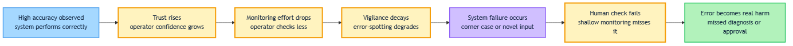

<!-- GENERATED FILE — DO NOT EDIT BY HAND.
     Cresent view of 15.4 — Automation Complacency.
     Source of truth: CIT 10.4.
     Regenerate: python Cresent/Technical/tools/generate_shared_readings.py -->
<!-- nav:top:start -->
Previous: [⬅ 15.3 — Case Study: AI Loan Approval at Scale](../15-3-case-study-3-ai-loan-approval-at-scale/reading.md)&emsp;·&emsp;[⬆ Table of Contents](../../../../../../README.md#part-b)&emsp;·&emsp;[15.5 — Human-in-the-Loop Checkpoints ➡](../15-5-human-in-the-loop-checkpoints/reading.md)
<!-- nav:top:end -->

---

# Automation complacency — how high accuracy makes humans less vigilant

## Overview

Imagine a spell-checker that is right 99 times out of 100. At first you read every suggestion carefully. After weeks of near-perfect results, you start clicking "accept all" without looking. One day it changes a technical term to the wrong word — and you submit without noticing. That scenario, scaled up to medical scans, loan approvals, and security threat detection, is **automation complacency**. This topic explains why high accuracy is, paradoxically, one of the biggest risk factors in human-AI systems — not despite the AI performing well, but because of it [1].

## Key Concepts

### Automation complacency

**Automation complacency** — the gradual reduction in a human operator's attention to an automated system, caused by the system repeatedly performing correctly [1].

Three things make it distinct from ordinary distraction:

- **Gradual** — it builds over time, not overnight.
- **Attention drops** — the operator watches less carefully, less often, or both.
- **Caused by correctness** — the trigger is the system being right, not wrong.

This is not laziness. It is a normal, predictable brain response. When a signal is consistently "all clear," the brain learns to treat monitoring as low priority and conserves mental energy for other tasks [1].

### Vigilance

**Vigilance** — sustained, active attention directed at watching for rare or unexpected events.

Vigilance is cognitively expensive. It takes real mental effort to stay alert for something that almost never happens. Think of a security guard watching an empty corridor on camera for an entire eight-hour shift — most of the time nothing happens, yet the moment it does, they must respond instantly.

### Vigilance decay

**Vigilance decay** — the well-documented drop in a person's ability to detect rare events the longer they monitor a system without incident [1].

Automation accelerates this natural tendency:

1. The AI handles routine cases correctly, hour after hour.
2. The human's active monitoring load drops — there is little to catch.
3. With less practice staying alert, the skill of spotting errors erodes faster.
4. By the time a real failure arrives, the operator is far less able to catch it than they were on day one [1].

### The accuracy paradox

**Accuracy paradox** — the finding that higher system accuracy tends to produce lower human vigilance, which in turn produces higher risk at the moments the system does fail [1][2].

The logic runs like this: the more accurate a system is, the rarer its failures become. The rarer failures are, the longer an operator goes without ever catching one. The longer they go without catching anything, the more the habit of not watching closely reinforces itself. When the rare failure finally arrives, the operator is least prepared for it.

A concrete number helps here. A system that is 99% accurate and makes a decision every 30 seconds fails roughly once every 50 minutes. An operator who has witnessed 1,000 consecutive correct decisions is not psychologically ready for failure number 1,001.

### Trust calibration

**Trust calibration** — having an accurate internal sense of how much to rely on a system, trusting it at exactly the level its real performance warrants — no more and no less [2].

Automation complacency is a specific form of over-trust: the operator's internal sense of the system's reliability drifts higher than actual performance justifies. Trust calibration can start accurate — trusting a 99%-correct system at 99% — and quietly drift over weeks or months to behaving as if the system is infallible.

---

The diagram below traces the full causal chain that links high accuracy to eventual harm.

*The seven-step chain from high accuracy through vigilance decay to real-world harm — each step follows predictably from the one before.*

---

### How complacency connects to override-as-theater

In topic 10.1 you saw that a **human override point** can become **override-as-theater** — a checkpoint that looks like oversight but provides none. Automation complacency is a primary mechanism behind that collapse. When an operator has seen thousands of correct AI decisions, their review of each new one becomes a formality. They are present at the override point, but their vigilance has decayed to the point where genuine review is no longer happening. The gate exists; the scrutiny does not [1][2].

## Worked Example

The following worked example traces the causal chain step by step through a single, concrete scenario.

**Scenario:** A hospital deploys an AI tool that pre-screens chest X-rays and flags potential findings for radiologists to review. The tool is accurate on 94% of scans.

| Step | What happens |
|------|-------------|
| 1. High accuracy observed | The radiologists review the tool's output for the first month. It is correct on almost every scan. They begin to trust it. |
| 2. Trust rises | This is rational — the system has earned trust through demonstrated performance. |
| 3. Monitoring effort decreases | Radiologists start spending more time reviewing AI-flagged areas and less time scanning the rest of the image independently. |
| 4. Vigilance decays | Weeks pass. Radiologists have rarely found an error on their own. The habit of thorough independent review weakens. |
| 5. System produces a failure | The AI misses a small but significant nodule in the lower lobe of one scan — a type of presentation it has rarely encountered in training. |
| 6. Operator does not catch it | The radiologist reviews the AI's output (nothing flagged), glances at the image briefly, and clears the scan. The nodule is not seen. |
| 7. Error becomes an outcome | The patient is not called back. The nodule is diagnosed at a much later stage. |

Two details from this example are worth holding onto:

- **Steps 3 and 4 are invisible from the outside.** A supervisor watching this radiologist would see someone sitting at their workstation, reviewing every scan. The decay is internal — it lives in the quality and depth of attention, not in observable behaviour. There is no moment where the operator decides "I will stop paying attention now." The shift happens gradually, scan by scan, over weeks. That is what makes vigilance decay so difficult to manage — it does not announce itself.
- **The AI's base error rate was always 6%.** The system never promised perfection. The danger came from what that 94% accuracy did to the human watching it, not from the 6% alone. A system that is right 94% of the time will, over a full working day of reviewing 80 scans, miss roughly 5 findings. If the radiologist is no longer conducting independent reviews, those 5 are not caught. The AI's accuracy did not cause the harm directly — the complacency it produced did.

## In Practice

Automation complacency appears wherever humans monitor accurate AI systems over long periods. Three domains have documented it clearly.

**Aviation autopilot**

Modern aircraft fly on autopilot for most of a flight. Pilots monitor rather than control for long stretches. Accident investigations have identified complacency as a contributing factor in crashes where the autopilot disengaged and pilots were slow to respond — not because they were unfit, but because extended low-demand monitoring had reduced their readiness [3].

This produces a specific effect called **out-of-the-loop performance decrement** — a pilot who has been out of active manual control for a long period shows measurably slower and less accurate responses when control is suddenly handed back [3].

**Medical imaging AI**

AI tools that pre-screen scans at accuracy above 90% shift radiologist attention toward AI-flagged areas. When the AI misses a finding — which it will, at its irreducible base error rate — the radiologist is less likely to catch it independently, because the AI's usual reliability has trained them to focus elsewhere [1].

**Content moderation**

Large platforms use AI to remove violating content at accuracy rates above 95%. Long stretches of correct decisions erode the vigilance of human audit teams. Novel harmful content — types the AI has not encountered before — passes through human review when reviewers have spent weeks processing thousands of correct AI decisions without catching a meaningful error [2].

**What these cases share**

- High accuracy created over-trust.
- Over-trust reduced the depth of human review.
- Reduced depth meant failures that were catchable were not caught.
- The failures that slipped through were exactly the novel or edge-case inputs hardest for the AI — and now also hardest for a complacent human.

Notice that in all three domains the operators were competent, experienced professionals — not careless people. The aviation pilots were trained and medically fit. The radiologists were qualified specialists. The content moderation teams were experienced reviewers. Complacency is not a character flaw. It is what happens to skilled humans who are placed in conditions that systematically reward reduced attention over long periods. Understanding this is important because it changes how you think about solutions. Blaming individuals or demanding they "just pay more attention" does not address the structural conditions that produced the complacency. The fix has to be built into the system — not into the person.

**Countermeasures exist** — audit sampling, uncertainty surfacing, and performance monitoring for human operators are covered later in this module. What matters here is understanding the problem they are solving: accuracy is not protection against complacency; in the wrong conditions, it is a cause.

## Key Takeaways

- **Automation complacency is caused by accuracy, not poor design.** A system being right repeatedly trains humans to stop checking as closely.
- **Vigilance decay is predictable, not personal.** It is a documented cognitive response to prolonged monitoring of a reliable system — not a sign of carelessness.
- **The accuracy paradox:** rare failures are the most dangerous, because the operator is least prepared for them precisely when they arrive.
- **Trust calibration drifts.** It can start at the right level and quietly shift toward over-trust over weeks or months without anyone noticing.
- **Complacency converts a genuine override point into override-as-theater.** The human is present at the checkpoint; the scrutiny is not.

## References

1. Sinha, N. et al. "Efficiency-accountability tradeoff and over-reliance effects in human-AI systems." *ScienceDirect*, 2024. [https://www.sciencedirect.com/science/article/pii/S2949882124000598](https://www.sciencedirect.com/science/article/pii/S2949882124000598)
2. Redefining the standard of human oversight for AI negligence. *Harvard Journal of Law and Technology Digest*, 2024. [https://jolt.law.harvard.edu/digest/redefining-the-standard-of-human-oversight-for-ai-negligence](https://jolt.law.harvard.edu/digest/redefining-the-standard-of-human-oversight-for-ai-negligence)
3. Tran, M. "UX Research Insights: Balancing AI Automation and Human Oversight in IT Operations." *UXmatters*, December 2025. [https://www.uxmatters.com/mt/archives/2025/12/ux-research-insights-balancing-ai-automation-and-human-oversight-in-it-operations.php](https://www.uxmatters.com/mt/archives/2025/12/ux-research-insights-balancing-ai-automation-and-human-oversight-in-it-operations.php)

---
<!-- nav:bottom:start -->
Previous: [⬅ 15.3 — Case Study: AI Loan Approval at Scale](../15-3-case-study-3-ai-loan-approval-at-scale/reading.md)&emsp;·&emsp;[⬆ Table of Contents](../../../../../../README.md#part-b)&emsp;·&emsp;[15.5 — Human-in-the-Loop Checkpoints ➡](../15-5-human-in-the-loop-checkpoints/reading.md)
<!-- nav:bottom:end -->
