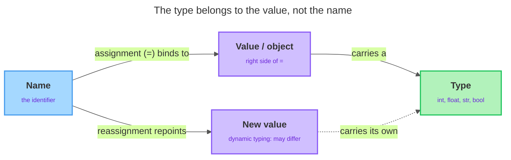

# Variables, Identifiers & Types

<sub>[&#8592; Previous: 1.1 The Python Environment](../../../../../../../content/ai_native_engineering_foundations/p1-python-foundations-syntax/week-1/1-python-foundations/1-1-the-python-environment/artifacts/reading.md)&nbsp;&nbsp;&nbsp;&nbsp;&nbsp;&nbsp;|&nbsp;&nbsp;&nbsp;&nbsp;&nbsp;&nbsp;[Go back to TOC](../../../../../../../README.md)&nbsp;&nbsp;&nbsp;&nbsp;&nbsp;&nbsp;|&nbsp;&nbsp;&nbsp;&nbsp;&nbsp;&nbsp;[Next: 1.3 Operators & Expressions &#8594;](../../../../../../../content/ai_native_engineering_foundations/p1-python-foundations-syntax/week-1/1-python-foundations/1-3-operators-expressions/artifacts/reading.md)</sub>

---

## Overview

In topic 1.1 you learned to type code into a Colab cell, run it, and use `print()` to see a result. But printing a value once and forgetting it is not very useful. Real programs need to *hold on* to values — a user's name, a price, a count of items — and reuse them later. That is what a **variable** does: it gives a value a name so you can refer to it as often as you like, and change it in one place instead of hunting down every copy. In this topic you will learn how to create variables, the rules for naming them, the four kinds of values you will use most often, and a small tool (`type()`) that tells you what kind of value you are holding. These are the building blocks for everything else in Python. _This contributes to A1 — Python Core Skills Checkpoint (due W3)._

## Key Concepts

<strong><u>Variables and assignment.</u></strong> A variable is a name that refers to a value. You create one with the **assignment operator**, the single equals sign `=`. The name goes on the left, the value goes on the right — `x = 5`. Read that as "let `x` refer to the value `5`," *not* as "x equals 5" in the math sense. In mathematics, `=` states a fact that is either true or false. In Python, `=` performs an *action*: it binds the name on the left to the object on the right [1]. After that line runs, any time you write `x`, Python looks up the value it points to and uses it in place of the name. Because the right side is worked out first and then handed to the name, you can put any value there — a number, some text, or even the value another variable is already holding. Writing `second = first` copies the *current* value of `first` and gives it to `second`; it does not link the two names together forever [1]. One habit to form early: a name must exist before you use it. If you try to `print(total)` before you have ever written `total = ...`, Python has no value to look up and reports a `NameError`. A variable comes into being the moment you first assign to it.

<strong><u>Reassignment.</u></strong> You are not stuck with the first value. You can **reassign** a variable — give it a new value — at any time by writing another assignment to the same name. The new assignment replaces the old one; the previous value is simply gone, and nothing in your program remembers it. This happens constantly in real programs: a score goes up, a balance goes down, a total grows. You can even use a variable's *current* value on the right side to compute its *next* value, as in `score = score + 50`. Python works out the whole right side first, using the old value, and only then rebinds the name to the result [1].

<strong><u>Identifiers — the naming rules.</u></strong> The name you give a variable is called an **identifier**. Python has firm *rules* about which names are legal and a separate *convention* about which names are good style. Rules are enforced by Python — break one and your code will not run. Conventions are agreements between programmers — break one and your code still runs, but other people (and future you) will find it harder to read. The rules are [3]:

- An identifier may contain letters, digits, and the underscore `_`.
- It must **not start with a digit**. `age2` is fine; `2age` is an error.
- It may not contain spaces or punctuation like `-`, `!`, or `$`. So `user-name` is illegal, but `user_name` is fine.
- It must not be a **reserved keyword**.

A broken name like `2age = 30` produces a `SyntaxError` — Python cannot even make sense of the line, so it stops before doing anything at all [3].

<strong><u>Reserved keywords and case sensitivity.</u></strong> **Reserved keywords** are words Python has already claimed for its own grammar — words like `if`, `for`, `class`, `def`, `True`, and `False`. You cannot use them as variable names, because Python needs them to mean their special thing [3]. You do not need to memorize the full list; just know that if a short, common English word causes a strange `SyntaxError`, a keyword clash is a likely cause. Rename it (for example, `iteration` instead of `for`). Separately, Python is **case sensitive**: it treats uppercase and lowercase letters as different, so `score`, `Score`, and `SCORE` are three completely separate variables with no connection between them [3]. This trips up beginners, because in everyday writing "Score" and "score" mean the same word. In Python they do not — pick one spelling per variable and stay consistent.

<strong><u>The `snake_case` convention.</u></strong> Legal is not the same as good. The official Python style guide, **PEP 8**, says variable names should be lowercase with words separated by underscores — a style called **`snake_case`** [2]. So write `user_name`, not `username` or `UserName`. If you have seen another language before, you may know **camelCase** (`userName`, `totalPrice`), which capitalizes each word after the first with no underscores. Python will happily *run* a camelCase name because it breaks no rule, but it is not the Python convention. Prefer `snake_case` [2]. Good names also *describe* the value: `total_price` tells a reader far more than `tp` or `x`, and costs only a few extra keystrokes.

<strong><u>Values and types.</u></strong> Every value in Python has a **type** — a category that says what kind of thing the value is. You will use four basic types constantly:

- **`int`** — an integer, a whole number with no decimal point: `5`, `0`, `-42`.
- **`float`** — a floating-point number, a number *with* a decimal point: `3.14`, `2.0`. Note that `2.0` is a `float` even though it equals a whole number, because it was *written* with a decimal point; `2` is an `int`. The decimal point is the deciding factor.
- **`str`** — a string, a piece of text wrapped in quotes: `"hello"`, `'Python'`. You can use single or double quotes; just be consistent within a value. The quotes are how Python knows it is text — `"5"` is the text five, while `5` is the number five.
- **`bool`** — a Boolean. `True` and `False` are the two values of type `bool`. Note the capital first letter; they are written that way and no other.

<strong><u>Inspecting types with `type()`.</u></strong> When you are unsure what type a value is, ask Python directly with the built-in **`type()`** function. Put a value or a variable inside the parentheses and it reports the type — for example, `type(30)` reports `<class 'int'>` [3]. The word `class` here just means "type," so read `<class 'int'>` as "this is an `int`." `type()` never changes the value; it just tells you what the value is, in one line.

<strong><u>Dynamic typing.</u></strong> When you wrote `age = 30` you never told Python "this is an integer" — you just assigned the value, and Python figured out the type on its own. This is called **dynamic typing** [1]. It means two things:

- You do not declare a variable's type in advance; the value you assign decides the type.
- A variable can refer to a value of one type now and a different type later, because the variable is just a name — it is the *value* that carries the type [1].

This makes Python flexible and quick to write. It also means *you* are responsible for tracking what a variable holds, which is exactly why `type()` is so handy.

**Mental model.** The diagram below captures the whole idea: a **name** (identifier) is bound by the assignment operator `=` to a **value/object**, which carries a **type**; reassignment repoints the same name to a new value, and under dynamic typing that new value may carry a different type.



## Worked Example

Assign one value of each of the four types, then use `type()` to confirm what each one is. Type this into a Colab cell and run it:

```python
items_in_cart = 3
unit_price = 4.50
customer_name = "Ada"
cart_is_empty = False

print(type(items_in_cart))
print(type(unit_price))
print(type(customer_name))
print(type(cart_is_empty))
```

Output:

```
<class 'int'>
<class 'float'>
<class 'str'>
<class 'bool'>
```

Each name follows `snake_case`, each value is one of the four basic types, and `type()` confirms which one it is [3]. Notice how the decimal point in `4.50` makes `unit_price` a `float`, while `3` with no decimal point makes `items_in_cart` an `int`.

Now watch dynamic typing directly by reassigning one name to values of different types:

```python
label = 100
print(type(label))

label = "one hundred"
print(type(label))
```

Output:

```
<class 'int'>
<class 'str'>
```

One name, two different types over its lifetime — Python allows this without complaint because the type rides along with the value, not with the name [1]. Running this yourself and reading the output is the single clearest demonstration of dynamic typing you can do.

## In Practice

A reliable habit when creating and checking a variable: choose a clear `snake_case` name, assign the value with `=`, and if you are unsure of the type, print `type(name)` to confirm. Reassign freely whenever the value needs to change. Watch out for these mistakes that actually bite beginners:

- **Losing the old value on reassignment.** Once you reassign a name, the previous value is gone [1]. If you still need it, save it in a second variable first — e.g. `old_balance = balance` before `balance = 40`.
- **Reaching for `camelCase`.** If you learned another language first, your fingers may want `userName`. Python will run it, but it violates PEP 8 [2]. Retrain early to `user_name`.
- **Shadowing keywords and built-in names.** Words like `for` and `class` are keywords and cause an outright `SyntaxError` [3]. Others, like `type`, are built-in names — assigning `type = 5` would quietly replace the `type()` function for the rest of the session. Choose a more specific name, such as `item_class`.
- **Case-sensitivity bugs.** Setting `total` but reading `Total` gives a `NameError`, because they are different variables [3]. When you get a `NameError` on a name you are sure you created, check the capitalization first.
- **Assuming a fixed type.** A variable that held a number a moment ago can hold text now, and nothing stops it [1]. If a program misbehaves, do not guess what a variable holds — check with `type()`.

## Key Takeaways

- A variable is a name that refers to a value; you create and change it with the assignment operator `=`, which binds the name on the left to the value on the right [1].
- Identifiers must follow Python's rules (letters, digits, underscores; no leading digit; no keywords) and should follow the `snake_case` convention from PEP 8 [2].
- Python names are case sensitive: `score` and `Score` are different variables [3].
- The four basic types are `int`, `float`, `str`, and `bool`; `type()` reports the type of any value [3].
- Python uses dynamic typing — the type belongs to the value, not the name — so a variable can hold different types over time [1].

## References

1. Real Python — Variables in Python. https://realpython.com/python-variables/
2. PEP 8 — Style Guide for Python Code. https://peps.python.org/pep-0008/
3. GeeksforGeeks — Python Variables. https://www.geeksforgeeks.org/python/python-variables/

---

<sub>[&#8592; Previous: 1.1 The Python Environment](../../../../../../../content/ai_native_engineering_foundations/p1-python-foundations-syntax/week-1/1-python-foundations/1-1-the-python-environment/artifacts/reading.md)&nbsp;&nbsp;&nbsp;&nbsp;&nbsp;&nbsp;|&nbsp;&nbsp;&nbsp;&nbsp;&nbsp;&nbsp;[Go back to TOC](../../../../../../../README.md)&nbsp;&nbsp;&nbsp;&nbsp;&nbsp;&nbsp;|&nbsp;&nbsp;&nbsp;&nbsp;&nbsp;&nbsp;[Next: 1.3 Operators & Expressions &#8594;](../../../../../../../content/ai_native_engineering_foundations/p1-python-foundations-syntax/week-1/1-python-foundations/1-3-operators-expressions/artifacts/reading.md)</sub>