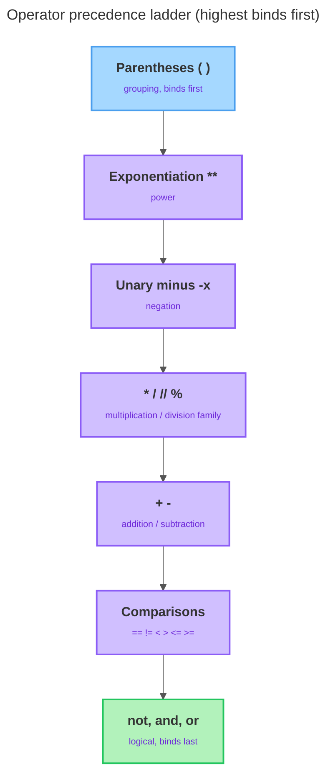

# Operators & Expressions

<sub>[&#8592; Previous: 1.2 Variables, Identifiers, Types](../../../../../../../content/ai_native_engineering_foundations/p1-python-foundations-syntax/week-1/1-python-foundations/1-2-variables-identifiers-types/artifacts/reading.md)&nbsp;&nbsp;&nbsp;&nbsp;&nbsp;&nbsp;|&nbsp;&nbsp;&nbsp;&nbsp;&nbsp;&nbsp;[Go back to TOC](../../../../../../../README.md)&nbsp;&nbsp;&nbsp;&nbsp;&nbsp;&nbsp;|&nbsp;&nbsp;&nbsp;&nbsp;&nbsp;&nbsp;[Next: 1.4 Statements, Conversion & Output &#8594;](../../../../../../../content/ai_native_engineering_foundations/p1-python-foundations-syntax/week-1/1-python-foundations/1-4-statements-conversion-output/artifacts/reading.md)</sub>

---

## Overview

In topic 1.2 you learned to name values and check their types with `type()`. But a program that only stores values does not *do* anything with them. The moment you want to add a price to a tax, check whether a score passed a threshold, or decide "is the cart empty *and* is the user logged in," you need **operators** — symbols (or short keywords) that combine values into a new value. When you put values, variables, and operators together into something Python can evaluate down to a single value, you have written an **expression**. This topic covers the five expression tools you will use in almost every program: arithmetic, precedence (which operator runs first), comparison, logical operators, and truthiness. Every comparison and logical expression produces a `bool`, and those booleans will drive the decisions your programs make later. _This contributes to A1 — Python Core Skills Checkpoint (due W3)._

## Key Concepts

An <strong><u>expression</u></strong> is any piece of code Python can evaluate to produce a single value [1]. `2 + 3` evaluates to `5`; `2 + 3 > 4` first evaluates `2 + 3` to `5`, then `5 > 4` to `True`. Every operator below takes one or more values (its **operands**) and hands back a result you can print, store, or feed into a larger expression [1][3].

<strong><u>Arithmetic operators</u></strong> do the math you expect on `int` and `float` values [1][3]:

| Operator | Name | Example | Result |
|----------|------|---------|--------|
| `+` | addition | `7 + 3` | `10` |
| `-` | subtraction | `7 - 3` | `4` |
| `*` | multiplication | `7 * 3` | `21` |
| `/` | true division | `7 / 2` | `3.5` |
| `//` | floor division | `7 // 2` | `3` |
| `%` | modulo (remainder) | `7 % 2` | `1` |
| `**` | exponentiation | `7 ** 2` | `49` |

The *type* of the result depends on the operands. If both are `int`, the result of `+`, `-`, or `*` is an `int`; but the moment even one operand is a `float`, the result "promotes" to a `float` to keep the fractional information [1][3]. So `7 + 3` is `10` but `7 + 3.0` is `10.0`.

The one place Python surprises newcomers is division. The single slash `/` is **true division**: it *always* gives a `float`, even when the numbers divide evenly, so `6 / 2` is `3.0`, not `3` [1]. The double slash `//` is **floor division**: it divides and rounds *down* to the nearest whole number, discarding the fraction. Read `//` as "how many whole times does the second number fit into the first?" — `20 // 6` is `3`. The precise rule is that `//` rounds *toward negative infinity*, never toward zero [2]. For positive numbers those descriptions agree, but for negatives they differ: `-7 // 2` is `-4` (the true answer `-3.5` rounded down), not `-3`.

The `%` operator gives the **remainder** after floor division [1][3]. It fits together with `//` so that `(a // b) * b + (a % b)` reconstructs `a`. Modulo has two common uses worth remembering now:

- **Even/odd test** — `n % 2` is `0` when `n` is even, `1` when odd; more generally `x % n == 0` tests whether `x` divides evenly by `n`.
- **Wrap-around** — keeping a number inside a fixed range like a 12-hour clock, where any hour taken `% 12` lands in `0..11` [3].

Because Python floors toward negative infinity, the remainder takes the sign of the *divisor*, so `-7 % 2` is `1`, not `-1` [2]. Finally, the double asterisk `**` is **exponentiation**: `7 ** 2` is `49`, `2 ** 10` is `1024`. Do not confuse `**` (power) with `*` (multiply) — `2 ** 3` is `8`, while `2 * 3` is `6`.

<strong><u>Operator precedence</u></strong> is a fixed ranking that decides which operators run first when an expression has more than one [1][2]. This is the "order of operations" from arithmetic class, extended to every Python operator. `2 + 3 * 4` is `14`, not `20`, because `*` outranks `+`. Here is the ladder, highest (runs first) at the top [2]:

| Precedence | Operators | Group |
|------------|-----------|-------|
| Highest | `()` | parentheses (grouping) |
| | `**` | exponentiation |
| | `-x` | unary minus (negation) |
| | `*`, `/`, `//`, `%` | multiplication / division family |
| | `+`, `-` | addition / subtraction |
| | `<`, `<=`, `>`, `>=`, `==`, `!=` | comparisons |
| | `not` | logical NOT |
| | `and` | logical AND |
| Lowest | `or` | logical OR |

Several facts fall out:

- `**` binds tighter than unary minus, so `-2 ** 2` reads as "negate `2 ** 2`" and gives `-4`; to square the negative you must write `(-2) ** 2`, which is `4` [2].
- Arithmetic runs before comparison, and comparison runs before logic — so `2 + 3 > 4 and 1 < 2` reads as `((2 + 3) > 4) and (1 < 2)`.
- When two operators share a precedence level (like `*` and `/`), Python evaluates left to right — **left-associativity** — so `20 / 4 * 2` is `(20 / 4) * 2 = 10.0`, not `2.5` [2].

You do not have to memorize the ladder: any time the order is not obvious, wrap the part you want done first in parentheses, which always win [1][2]. Adding them for clarity costs nothing and never makes a correct expression wrong.

<strong><u>Comparison operators</u></strong> compare two values and produce a `bool` — either `True` or `False` [1][3]. A comparison is a question, and Python answers yes or no.

| Operator | Meaning | Example | Result |
|----------|---------|---------|--------|
| `==` | equal to | `5 == 5` | `True` |
| `!=` | not equal to | `5 != 3` | `True` |
| `<` | less than | `3 < 5` | `True` |
| `>` | greater than | `3 > 5` | `False` |
| `<=` | less than or equal to | `5 <= 5` | `True` |
| `>=` | greater than or equal to | `3 >= 5` | `False` |

These work on more than numbers: two `str` values are equal only if they are the exact same text, character for character, and comparison is case sensitive (just as identifiers were in 1.2), so `"cat" == "Cat"` is `False` [3]. **The single most common beginner bug** is confusing `==` with `=`. A single `=` is the **assignment** operator from 1.2 — it stores a value in a variable. A double `==` is the **equality comparison** — it asks a question and yields `True` or `False` [1]. `x = 5` puts `5` into `x`; `x == 5` asks "does `x` equal `5`?" Python also lets you **chain** comparisons the way mathematics does: instead of `18 <= age and age < 65`, write `18 <= age < 65`, and Python reads it as "is `age` between 18 and 65?", evaluating each link and combining them for you [1][2].

<strong><u>Logical operators</u></strong> combine or invert `bool` values into compound conditions [1][3]. There are exactly three, written as plain English words:

- `A and B` is `True` only when *both* are true.
- `A or B` is `True` when *at least one* is true.
- `not A` flips the value.

| `A` | `B` | `A and B` | `A or B` |
|-----|-----|-----------|----------|
| `True` | `True` | `True` | `True` |
| `True` | `False` | `False` | `True` |
| `False` | `True` | `False` | `True` |
| `False` | `False` | `False` | `False` |

Among these three, precedence runs highest to lowest as `not`, then `and`, then `or` [2]. So `True or False and False` reads as `True or (False and False)` = `True`, not `(True or False) and False`. In practice you rarely type bare booleans — you combine *comparisons*, and because comparisons outrank the logical operators, `age >= 18 and has_ticket` reads naturally without extra parentheses [2].

The logical operators are also <strong><u>short-circuit</u></strong>: Python evaluates the left side first and stops early if the answer is already decided [1]. For `and`, if the left side is falsy the whole thing cannot be true, so the right side is skipped; for `or`, if the left side is truthy the result is already true, so the right side is skipped. This is a tool, not a trick: put a cheap or protective check on the left and a riskier one on the right, and Python will skip the right side when it is safe to do so.

Finally, <strong><u>truthiness</u></strong>: Python treats *any* value as "true-ish" or "false-ish" in a logical context [1][3]. The **falsy** values are a short list — `False`, the numbers `0` and `0.0`, and the empty string `""`. Almost everything else is **truthy**: any non-zero number (including negatives like `-3`) and any non-empty string (even `"False"` written as text, because it is a non-empty string, not the boolean). These truthy/falsy verdicts are exactly what `and`, `or`, and `not` react to.

**The precedence ladder at a glance.** The diagram below shows the order operators run in — top binds first, bottom binds last. When an expression mixes levels, work down this ladder (or add parentheses to override it).



## Worked Example

Here we assemble a realistic "may this user enter?" condition step by step, storing intermediate booleans in well-named `snake_case` variables:

```python
score = 85
is_member = True
is_banned = False

passed = score >= 60
print(passed)
print(type(passed))

in_range = 60 <= score <= 100
print(in_range)

may_enter = passed and is_member and not is_banned
print(may_enter)
```

Output:

```
True
<class 'bool'>
True
True
```

`score >= 60` produces the `bool` `True`, stored in `passed`, and `type()` confirms it is a `bool` [1]. `60 <= score <= 100` is a chained comparison asking "is the score in the range 60–100?" — `True` here [2]. Finally `may_enter` combines three booleans: the person passed, is a member, and is *not* banned. Because `not` binds tighter than `and`, `not is_banned` is evaluated first (to `True`), and `True and True and True` is `True` [2].

## In Practice

- **Match the division operator to your meaning.** `/` always returns a `float` (`10 / 2` is `5.0`); use `//` when a fractional answer makes no sense and you want the floored whole number [1].
- **Never confuse `=` with `==`.** `=` assigns; `==` compares. If your code "always does the same thing" regardless of data, check for one equals sign where you needed two [1].
- **Use parentheses when mixing precedence levels.** They cannot make a correct expression wrong and they remove doubt — the classic fix is `(-2) ** 2` to square a negative, since `**` outranks unary minus [2].
- **Watch negatives with `//` and `%`.** Rounding is toward negative infinity, and the remainder follows the divisor's sign, so `-7 // 2` is `-4` and `-7 % 2` is `1`. Print boundary values to confirm [2].
- **Reach for `%` for even/odd, divisibility, and wrap-around.** `x % 2`, `x % n == 0`, and cycling through a fixed range are the everyday uses [3].
- **Be careful relying on truthiness of empty values.** `""`, `0`, and `0.0` are falsy [3]. `name or "guest"` neatly supplies a default, but if `0` is a *valid* value, prefer an explicit `x == 0` over a truthiness test, which would wrongly treat it as "missing" [1][3].

## Key Takeaways

- Arithmetic operators include `+ - * **`, plus two divisions: `/` (true division, always a `float`) and `//` (floor division, rounds toward negative infinity), and `%` (remainder, whose sign follows the divisor); mixing an `int` with a `float` promotes the result to `float` [1].
- Operator precedence fixes which operator runs first (`**` before unary minus, the `*`/`/`/`//`/`%` family before `+`/`-`, arithmetic before comparison, comparison before logical, and `not` before `and` before `or`); parentheses override it and make intent clear [1][2].
- Comparison operators (`==`, `!=`, `<`, `>`, `<=`, `>=`) each produce a `bool`, can be chained as in `1 < x < 10`, and must not be confused with `=` (assign) versus `==` (compare) [1][3].
- Logical operators `and`, `or`, and `not` combine or invert conditions using short-circuit evaluation, skipping the right side when the result is already decided [1].
- Truthiness means every value acts as true or false in a logical context: `False`, `0`, `0.0`, and `""` are falsy; everything else is truthy — and that verdict is what `and`, `or`, and `not` react to [3].

## References

1. Real Python — Operators and Expressions in Python. https://realpython.com/python-operators-expressions/
2. Python Language Reference — Expressions. https://docs.python.org/3/reference/expressions.html
3. GeeksforGeeks — Python Operators. https://www.geeksforgeeks.org/python/python-operators/

---

<sub>[&#8592; Previous: 1.2 Variables, Identifiers, Types](../../../../../../../content/ai_native_engineering_foundations/p1-python-foundations-syntax/week-1/1-python-foundations/1-2-variables-identifiers-types/artifacts/reading.md)&nbsp;&nbsp;&nbsp;&nbsp;&nbsp;&nbsp;|&nbsp;&nbsp;&nbsp;&nbsp;&nbsp;&nbsp;[Go back to TOC](../../../../../../../README.md)&nbsp;&nbsp;&nbsp;&nbsp;&nbsp;&nbsp;|&nbsp;&nbsp;&nbsp;&nbsp;&nbsp;&nbsp;[Next: 1.4 Statements, Conversion & Output &#8594;](../../../../../../../content/ai_native_engineering_foundations/p1-python-foundations-syntax/week-1/1-python-foundations/1-4-statements-conversion-output/artifacts/reading.md)</sub>