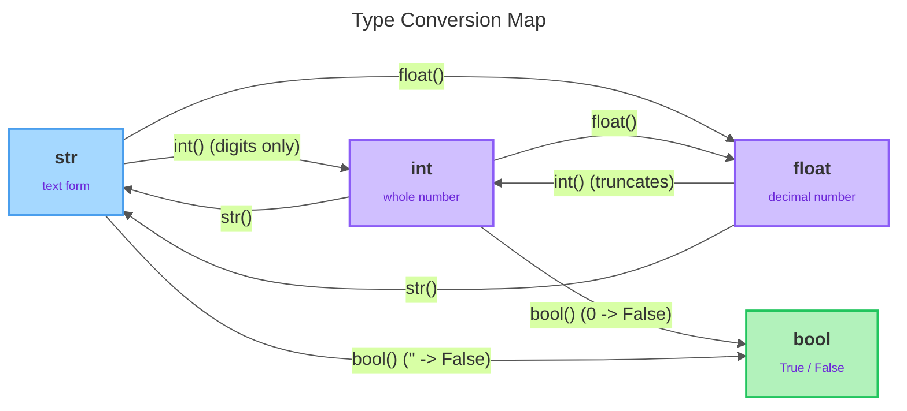

# Statements, Conversion & Output

<sub>[&#8592; Previous: 1.3 Operators & Expressions](../../../../../../../content/ai_native_engineering_foundations/p1-python-foundations-syntax/week-1/1-python-foundations/1-3-operators-expressions/artifacts/reading.md)&nbsp;&nbsp;&nbsp;&nbsp;&nbsp;&nbsp;|&nbsp;&nbsp;&nbsp;&nbsp;&nbsp;&nbsp;[Go back to TOC](../../../../../../../README.md)&nbsp;&nbsp;&nbsp;&nbsp;&nbsp;&nbsp;|&nbsp;&nbsp;&nbsp;&nbsp;&nbsp;&nbsp;[Next: 2.1 Conditionals &#8594;](../../../../../../../content/ai_native_engineering_foundations/p2-control-structures-functions-tooling/week-2/1-control-structures-functions-1/2-1-conditionals/artifacts/reading.md)</sub>

---

## Overview

Across topics 1.1 through 1.3 you learned to run code in Colab, store values in variables, know their types, and combine them with operators. That gives you raw capability, but a snippet that computes a number and never shows it clearly is not yet a program. This topic is the module closer: it turns that capability into code that *communicates*. Three everyday problems come together here — real data rarely arrives in the type you want (a number typed by a user comes in as text, `"42"`, not `42`), a finished result needs to be *shown nicely* (two decimals for a price, values lined up in a column), and growing programs need to be *read* by you and your teammates through comments, consistent style, and a couple of newer syntax forms you'll increasingly meet in real Python. None of this is exotic. It is the glue that connects "I computed something" to "I displayed it clearly to a human." _This contributes to A1 — Python Core Skills Checkpoint (due W3)._

## Key Concepts

**Statements: assignment vs expression.** A **statement** is a complete instruction Python executes. You have already been writing them: `x = 5` is a statement, and so is `print(x)`. Two kinds matter here:

- **Assignment statement** — binds a value to a name using `=`; it does not produce a value of its own, it *stores* one, as in `total = 10 + 5`.
- **Expression statement** — an expression written on its own line, evaluated for its result or its side effect; the `print(...)` call is the one you'll write most, as in `print(total)`.

The key difference: an assignment *saves* a value for later use, while an expression statement *does* something now (like printing) and, in a script, its value is discarded unless you capture it.

**Chained assignment and tuple unpacking.** Python offers two compact assignment forms that save typing and make intent clear:

- **Chained assignment** — binds the same value to several names at once; `a = b = 5` makes both `a` and `b` refer to `5`, handy when several variables should start at the same value.
- **Tuple unpacking** — assigns several values in one statement by matching them position-by-position: in `x, y = 1, 2`, the names on the left pair with the values on the right left-to-right, so `x` becomes `1` and `y` becomes `2`. The counts must match — two names, two values.

Unpacking powers a clean trick: swapping two variables with no temporary holder, written `x, y = y, x`. Python evaluates the whole right side first and *then* assigns, so the swap just works. (You are seeing the form `1, 2` used purely as an *assignment mechanism* here; tuples as a full data structure come in a later course.)

**Type conversion.** Every value has a type. **Type conversion** — also called casting — produces a *new* value of a different type from an existing one, without changing the original; you get a converted copy back. Python gives you one conversion function per basic type — `int()`, `float()`, `str()`, and `bool()` [2]:

- **`str()`** — turns any value into its text form; the one you'll use most, because output is text. `str(42)` gives the text `"42"`, which looks the same when printed but is now a `str`.
- **`int()`** — turns a value into a whole number: from a string of digits it parses the number; from a float it **truncates**, chopping off the decimal part rather than rounding. So `int(3.9)` is `3`, not `4`, and because truncation always moves *toward zero*, `int(-3.9)` is `-3` [2]. `int("5")` works because `"5"` is a clean integer string, but `int("3.14")` raises a `ValueError`, because `"3.14"` is not a whole number in text form.
- **`float()`** — turns a value into a floating-point number by parsing text (`float("3.14")` → `3.14`) or by adding a decimal point to an integer (`float(42)` → `42.0`).
- **`bool()`** — converts using the truthiness rules from 1.3: the falsy values `0`, `0.0`, and `""` (empty string) convert to `False`, while almost everything else — `42`, `"hi"` — converts to `True` [2].

The classic problem conversion solves: text that *looks* like a number is still text, so `"5" + 3` is an error; convert first, and `int("5") + 3` gives `8`.

**String basics: quotes, concatenation, indexing.** A **string** (`str`) is text in quotes. Python accepts **single or double quotes** with no difference in meaning — pick one and be consistent. Both exist so you can avoid escaping: use double quotes when the text contains an apostrophe (`"it's fine"`) and single quotes when it contains a double quote. **Concatenation** joins strings with `+`, and both sides must be strings — exactly why `str()` matters. So `first + " " + last` with `first = "Ada"` and `last = "Lovelace"` produces `Ada Lovelace`. **Indexing** reads one character out of a string by its position, written in square brackets, and positions start at **0**, not 1. For `name = "Python"`, `name[0]` is `P` and `name[1]` is `y`. That is enough to grab a character by position; slicing and the full string toolkit come later.

**Formatted output with f-strings.** The best way to build readable output is the **f-string** (formatted string literal): a string prefixed with the letter `f`, in which anything inside curly braces `{}` is evaluated and its result dropped into the text [1]. So `f"{name} is {age} years old"` produces `Ada is 42 years old` — no `+`, no `str()` calls, because Python converts each embedded value to text for you. Because the braces hold an *expression*, you can embed any expression, including the operators from 1.3: `f"Total: {price * qty}"` computes and inserts the product, and `f"Cheaper? {price < 25}"` inserts `True` or `False` [1]. **Format specifiers** go after a colon inside the braces and control *how* the value is displayed [1]. The four you need:

- `:.2f` — a float shown to 2 decimal places (`f` = fixed-point, `.2` = two decimals). Ideal for money; `{price:.2f}` on `19.5` gives `19.50`.
- `:d` — an integer in plain decimal form; `{42:d}` gives `42`.
- `:>10` — right-align the value in a field 10 characters wide (`>` = align right).
- `:^15` — center the value in a field 15 characters wide (`^` = center).

The alignment specifiers pad with spaces to make columns line up — invaluable when printing tables of data. You can combine width and precision too: `{price:>10.2f}` right-aligns a two-decimal number in a 10-wide field.

**Type hints (introduction).** A **type hint**, also called an annotation, records what type a variable is *expected* to hold. You write it with a colon after the name: `count: int = 0`, `name: str = "Ada"`, `price: float = 9.99`. The hint after the colon is documentation for humans and tools. Python does **not** enforce it — assigning a string to `count` would still run — but editors and type-checkers use hints to catch mistakes and to autocomplete, making code self-describing. You will also see hints on functions, which look like `def area(w: float, h: float) -> float:`. You'll meet functions properly in a later course; for now, just recognize the shape when you see it. The takeaway at this stage is simply that `name: type` is Python telling you and the tools what a value is meant to be.

**match-case (introduction).** `match`/`case` is **structural pattern matching**: you give it a value, and it runs the first `case` whose pattern matches [3]. On simple values it reads like a clean multi-way choice — Python compares the value against each `case` top-to-bottom, runs the first that matches, and skips the rest. The underscore `case _` is the **wildcard**, a catch-all "none of the above" that matches anything [3]. This is an *introduction*: recognize the shape — `match value:` followed by indented `case pattern:` blocks. Pattern matching on richer shapes, and the general control flow it relates to, come later.

**Comments and readability (PEP 8 intro).** A **comment** is text Python ignores — it's for humans reading the code. A line comment starts with `#`, and everything after it on that line is skipped, as in `tax_rate = 0.08  # 8% sales tax`. Good comments explain *why*, not the obvious *what*: `# add tax` above a total line says nothing the code doesn't, but `# state law requires rounding up` earns its place. **PEP 8** is Python's official style guide (you met its `snake_case` rule in 1.2). A few basics: use spaces around operators (`x = 5`, not `x=5`), write one statement per line, keep lines reasonably short, and use blank lines to separate logical chunks. Consistent style makes code readable to every Python programmer — which matters the moment more than one person touches it.

**The conversion map.** The diagram below shows how a value moves between the four basic types — each arrow is the conversion function you call, with the behaviours worth remembering (whole-number strings only for `int()`, truncation from `float`, `0`/`""` → `False`).



## Worked Example

A reliable pattern for turning raw values into clean output is: get the value in whatever type it arrives (often `str`), convert it to the type you need, compute with operators, format the result into an f-string with the right specifier, and print it. Here is a tiny receipt line that uses every piece from this topic. Type it into a Colab cell and run it:

```python
item: str = "Coffee"        # type hint documents intent
price_text: str = "4.5"     # imagine this came in as text
quantity: int = 3

price = float(price_text)   # convert text -> float
total = price * quantity    # compute with 1.3 operators

print(f"{item:>10}: {quantity:d} x {price:.2f} = {total:.2f}")
```

Output:

```
    Coffee: 3 x 4.50 = 13.50
```

Read it piece by piece. The three type hints (`: str`, `: int`) document what each name is meant to hold but do not enforce anything [2]. `float(price_text)` converts the text `"4.5"` into the number `4.5` so it can be multiplied — without that conversion, `price_text * quantity` would not do the arithmetic you want [2]. The multiplication uses the operators from 1.3. Finally, the single f-string carries three specifiers: `{item:>10}` right-aligns `"Coffee"` in a 10-wide field (note the leading spaces in the output), `{quantity:d}` shows the count as a plain integer, and `{price:.2f}` and `{total:.2f}` pin the money values to two decimals [1]. One f-string replaces what would otherwise be a messy chain of `+` and `str()` calls.

## In Practice

Where this shows up and the mistakes that actually bite beginners:

- **Adding a number to text.** `"5" + 3` raises a `TypeError` — the single most common beginner error. Convert first: `int("5") + 3` → `8` [2].
- **Expecting `int()` to round.** `int(3.9)` is `3`, not `4`; `int()` truncates toward zero and always chops. If you need rounding, that's a different tool [2].
- **`int("3.14")` crashes.** `int()` only parses whole-number strings; a decimal string raises `ValueError`. Use `float("3.14")` for decimals, then convert to int if you need to.
- **Forgetting the `f`.** `print("{name}")` prints the literal text `{name}`, because the braces are only special in an f-string [1].
- **`:.2f` on an int.** `f"{42:.2f}"` gives `42.00` — the `f` specifier coerces the value to float form. Handy, but know it happens [1].
- **Assuming type hints enforce anything.** They don't. `count: int = "oops"` runs fine; hints guide humans and tools, not the interpreter.
- **Do** use f-strings for all formatted output, `:.2f` for money, and `:>`/`:^` to line up columns; comment the *why*, and follow PEP 8 (spaces around operators, `snake_case`, one statement per line) [1].

## Key Takeaways

- Assignment statements store a value; expression statements (like `print()`) act now. Chained assignment (`a = b = 5`) and tuple unpacking (`x, y = 1, 2`, including the swap `x, y = y, x`) are compact assignment forms.
- `int()`, `float()`, `str()`, and `bool()` convert between types; `int()` truncates toward zero, `int("3.14")` raises `ValueError`, and `bool()` follows truthiness (`0`, `0.0`, `""` → `False`) [2].
- Strings use single or double quotes, join with `+`, and index from position `0` with `[]`.
- f-strings embed expressions in `{}` and format with specifiers — `:.2f`, `:d`, `:>10`, `:^15` — for clean, aligned output [1].
- Type hints (`count: int = 0`) and `match`/`case` are readable modern syntax you should recognize, not yet master; comments and PEP 8 style keep code readable for everyone [3].

## References

1. Real Python — Python's F-String for String Interpolation and Formatting. https://realpython.com/python-f-strings/
2. Real Python — Python String Formatting. https://realpython.com/python-string-formatting/
3. PEP 636 — Structural Pattern Matching: Tutorial. https://peps.python.org/pep-0636/

---

<sub>[&#8592; Previous: 1.3 Operators & Expressions](../../../../../../../content/ai_native_engineering_foundations/p1-python-foundations-syntax/week-1/1-python-foundations/1-3-operators-expressions/artifacts/reading.md)&nbsp;&nbsp;&nbsp;&nbsp;&nbsp;&nbsp;|&nbsp;&nbsp;&nbsp;&nbsp;&nbsp;&nbsp;[Go back to TOC](../../../../../../../README.md)&nbsp;&nbsp;&nbsp;&nbsp;&nbsp;&nbsp;|&nbsp;&nbsp;&nbsp;&nbsp;&nbsp;&nbsp;[Next: 2.1 Conditionals &#8594;](../../../../../../../content/ai_native_engineering_foundations/p2-control-structures-functions-tooling/week-2/1-control-structures-functions-1/2-1-conditionals/artifacts/reading.md)</sub>
