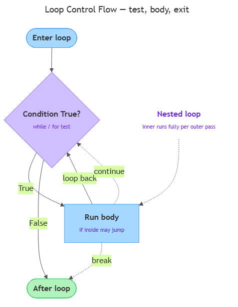

# Loops

<sub>[&#8592; Previous: 2.1 Conditionals](../../../../../../../content/ai_native_engineering_foundations/p2-control-structures-functions-tooling/week-2/1-control-structures-functions-1/2-1-conditionals/artifacts/reading.md)&nbsp;&nbsp;&nbsp;&nbsp;&nbsp;&nbsp;|&nbsp;&nbsp;&nbsp;&nbsp;&nbsp;&nbsp;[Go back to TOC](../../../../../../../README.md)&nbsp;&nbsp;&nbsp;&nbsp;&nbsp;&nbsp;|&nbsp;&nbsp;&nbsp;&nbsp;&nbsp;&nbsp;[Next: 3.1 Functions &#8594;](../../../../../../../content/ai_native_engineering_foundations/p2-control-structures-functions-tooling/week-3/1-functions-modules-tooling-2/3-1-functions/artifacts/reading.md)</sub>

---

## Overview

Conditionals let a program choose a path once. But most real work is repetitive: print every character of a name, count down from ten, keep asking for input until the user finally types something valid. A **loop** runs a block of code over and over — either a fixed number of times or until a condition changes — so you never have to write the same statement out by hand. Python gives you two loop keywords: `while`, which repeats *as long as* a condition is `True`, and `for`, which repeats *once for each item* in a sequence [1]. This reading covers every construct this week's labs need: a `while` countdown, a `for` walk over a string with `enumerate`, and a multiplication table built from nested loops. _This contributes to A1 — Python Core Skills Checkpoint (due W3)._

## Key Concepts

### The `while` loop: repeat as long as a condition holds

A `while` loop has the same shape as an `if`: a header line ending in a colon, then an indented block. The difference is what happens after the block runs — Python goes *back* to the top and tests the condition again, repeating the block as long as the condition is `True` and stopping the moment it becomes `False` [1].

```python
count = 5

while count > 0:
    print(count)
    count = count - 1

print("Lift off!")
```

Read it literally: "while `count > 0` is `True`, run the block." It prints `5`, `4`, `3`, `2`, `1`, and when `count` reaches `0` the condition is `False`, so the loop ends and `Lift off!` prints. The crucial line is `count = count - 1`: something inside the loop must eventually make the condition `False`. That is the loop's *progress* toward stopping.

The diagram below shows this cycle for both loop types — test the condition, run the body, loop back, and exit — including how `break` and `continue` redirect that flow and how one loop nests inside another.


*The test-body-loopback-exit cycle shared by `while` and `for`, with dotted `break`/`continue` paths and a nested-loop note.*

### Infinite loops and how to avoid them

If the condition never becomes `False`, the loop never stops — an **infinite loop**, the classic `while` bug [3]. If you forget `count = count - 1` above, `count > 0` stays `True` and the program prints `5` endlessly until you force it to quit. The discipline is simple: **every `while` loop needs something in its body that moves the condition toward `False`.** Before running one, ask: "What changes each pass, and how does that eventually make the condition false?" An infinite loop is not always a mistake — `while True:` is a common pattern *when paired with a `break`* (below) that leaves on some event. The rule is only that there must be *some* way out.

### The `for` loop and the loop variable

A `for` loop repeats its block **once for each item in a sequence**. On each pass the **loop variable** is set to the next item, and the block runs with that value [1]. You do not manage a counter or a stop condition — the `for` loop walks the sequence to its end for you. A string is a sequence of characters, so you can loop over one directly:

```python
for letter in "cat":
    print(letter)
```

This prints `c`, then `a`, then `t`. The name `letter` is your choice — pick one that describes a single item [2]. Use a `for` loop when you know the collection you are walking; use a `while` loop when you repeat until a condition changes and do not know the count in advance.

### `range()`: generating numeric sequences

To repeat something a fixed number of times, `range()` produces a sequence of integers for a `for` loop to walk [1]:

- `range(stop)` — counts from `0` up to but **not including** `stop`.
- `range(start, stop)` — counts from `start` up to but not including `stop`.
- `range(start, stop, step)` — counts from `start` toward `stop`, moving by `step` each pass.

```python
for i in range(5):
    print(i)            # 0 1 2 3 4

for i in range(0, 10, 2):
    print(i)            # 0 2 4 6 8
```

Two things trip people up. The `stop` value is **exclusive** — `range(5)` gives `0` through `4`, not `1` through `5` [1]. And `step` can be negative to count *down*: `range(5, 0, -1)` yields `5 4 3 2 1`, a counter-free way to write the countdown. `range()` is the standard way to say "do this N times."

### `enumerate()` and `zip()`: index-with-value and paired sequences

When you loop over a sequence you often want to know *where* you are as well as *what* the value is. `enumerate()` gives both — on each pass it hands back a counter (starting at `0`) and the item [1][2]:

```python
for index, letter in enumerate("cat"):
    print(index, letter)     # 0 c / 1 a / 2 t
```

Here `index, letter` unpacks the two values into two loop variables at once. To start the count at `1`, pass a start value: `enumerate("cat", 1)` [2]. `zip()` solves a different problem — walking **two sequences together**, one item from each per pass, stopping at the **shorter** sequence [1][2]:

```python
for letter, digit in zip("abc", "123"):
    print(letter, digit)     # a 1 / b 2 / c 3
```

### `break` and `continue`: controlling the loop from inside

Two keywords change a loop's flow from within its body [1]:

- **`break`** immediately **leaves the loop entirely**; execution jumps to the first statement after it.
- **`continue`** **skips the rest of the current iteration** and goes straight to the next one.

`break` is what turns a deliberate `while True:` into a controlled loop — for example, stop searching once you find your target. `continue` skips a pass without leaving: `if i % 2 == 0: continue` before a `print` prints only odd numbers. Both usually sit under an `if` inside the loop — where conditionals and loops combine. In short: `break` says "I am done with this loop"; `continue` says "I am done with *this one pass*, move on."

### Nested loops

A loop's body can contain another loop — a **nested loop** [3]. For every single pass of the outer loop, the inner loop runs all the way through. This is how you produce a grid or table, pairing every outer value with every inner value. If the outer loop runs `n` times and the inner `m` times, the inner body runs `n × m` times, so keep nesting shallow — two levels are common, but each added level multiplies the work and the difficulty of reading it.

### The loop `else` clause

Python allows an optional `else` attached to a loop. The `else` block runs **only if the loop finished normally** — without being stopped by a `break` [1]. It is a compact way to say "do this if we searched the whole sequence and never found what we were looking for." It is a niche feature: recognise it when you see it, and reach for it only when it genuinely reads more clearly than a flag variable.

## Worked Example

The week's **while countdown** lab reads a number and counts down to zero with a clean exit:

```python
count = int(input("Count down from: "))

while count > 0:
    print(count)
    count = count - 1
print("Done.")
```

Step by step:

1. `input(...)` reads text from the user; `int(...)` converts it into a number (topic 1.4). Say the user types `3`, so `count` is `3`.
2. Python tests `count > 0`. `3 > 0` is `True`, so it enters the block: prints `3`, then sets `count = count - 1`, making `count` become `2`.
3. It loops back and tests again. `2 > 0` is `True` → prints `2`, `count` becomes `1`. `1 > 0` is `True` → prints `1`, `count` becomes `0`.
4. Now `0 > 0` is `False`, so the loop ends and `print("Done.")` runs.

The decrement line is what guarantees the condition marches toward `False`, so the loop always ends. Swap the `while` for `for i in range(3, 0, -1): print(i)` and you get the same countdown without managing a counter — a good example of when a `for` loop is the cleaner choice.

## In Practice

Where loops show up, and the common do/don't:

- **Input validation.** A `while True:` reads input and `break`s once it passes a check, otherwise loops again — the everyday reason to write `while True:` with a `break`.
- **Search.** Loop over a sequence, `break` the moment you find the target, and use the loop `else` to handle "not found."
- **Counting and totals.** A `for i in range(...)` loop that accumulates a running number underlies progress counters, sums, and averages.
- **Grids and tables.** Nested loops generate anything two-dimensional — multiplication tables, coordinate pairs, rows-and-columns reports.

Best practices:

- **Guarantee progress in every `while` loop**, or use a deliberate `break`. Never leave a loop with no way out by accident.
- **Prefer `for` when you know the sequence** — it manages the counter and stopping for you, so it cannot run away like a mis-written `while`.
- **Reach for `enumerate()`** when you want index *and* value, and `zip()` when you want two sequences in step; both read more clearly than manual index bookkeeping [2].
- **Keep nesting shallow** — three or more levels usually signals it is time to rethink the structure.
- **Name loop variables for what they hold** (`letter`, `i`, `row`) so each pass reads clearly.

## Key Takeaways

- A `while` loop repeats as long as its condition is `True`; every one must contain something that eventually makes the condition `False` (or a `break`), or it runs forever.
- A `for` loop runs once per item in a sequence, binding each item to the loop variable; use it to walk a string or a `range()`.
- `range()` produces integers with `start`, `stop`, and `step`, where `stop` is exclusive and `step` may be negative to count down.
- `enumerate()` pairs each item with an index, and `zip()` walks two sequences together, stopping at the shorter one.
- `break` leaves a loop immediately; `continue` skips to the next iteration; a loop `else` runs only when the loop finishes without a `break`.
- Nested loops run the inner loop fully for each pass of the outer loop — keep the nesting shallow.

These constructs let you translate a repetitive plain-English task ("keep asking until valid," "print each character with its position") into tested control flow — the exact skill A1, the Python Core Skills Checkpoint, will measure.

## References

1. Python Software Foundation. *More Control Flow Tools* — Python 3 Tutorial. https://docs.python.org/3/tutorial/controlflow.html
2. nkmk. *How to use for loops in Python (range, enumerate, zip)*. https://note.nkmk.me/en/python-for-usage/
3. Czech Technical University. *Lecture 5: Iteration and Loops*. https://cw.fel.cvut.cz/b211/_media/courses/be5b33prg/lectures/lec05-iteration.pdf

---

<sub>[&#8592; Previous: 2.1 Conditionals](../../../../../../../content/ai_native_engineering_foundations/p2-control-structures-functions-tooling/week-2/1-control-structures-functions-1/2-1-conditionals/artifacts/reading.md)&nbsp;&nbsp;&nbsp;&nbsp;&nbsp;&nbsp;|&nbsp;&nbsp;&nbsp;&nbsp;&nbsp;&nbsp;[Go back to TOC](../../../../../../../README.md)&nbsp;&nbsp;&nbsp;&nbsp;&nbsp;&nbsp;|&nbsp;&nbsp;&nbsp;&nbsp;&nbsp;&nbsp;[Next: 3.1 Functions &#8594;](../../../../../../../content/ai_native_engineering_foundations/p2-control-structures-functions-tooling/week-3/1-functions-modules-tooling-2/3-1-functions/artifacts/reading.md)</sub>
