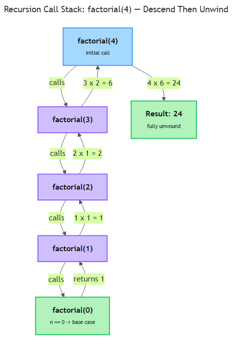

# Functions

## Overview

You have been calling functions since Topic 1.4 — every `print()` and `int()` hands work to code someone else wrote and gets an answer back. This topic teaches you to write your own: a named, reusable block of code that takes some inputs, does one job, and gives back a result. That shift, from one long script to organized, callable pieces, is what lets a program grow past a few lines without collapsing into spaghetti. It also happens to be the exact skill your Week 3 assessment tests: A1 asks you to turn a plain-English problem into code a test can check, and a function that *returns* a value is testable in a way a script that only prints never is. _This contributes to A1 — Python Core Skills Checkpoint (due W03)._

## Key Concepts

### Defining, calling, and returning

Create a function with the `def` keyword, a name, a pair of parentheses, and a colon. The indented block underneath is the function's **body**. Defining a function does not run it — it only teaches Python what the name means. You **call** it later by writing the name followed by parentheses [1].

```python
def greet():
    print("Hello there")

greet()   # runs the body -> Hello there
```

A function that only prints has done something visible but handed nothing back to whoever called it. The `return` statement ends the function immediately and produces a value the caller can store or reuse [1]:

```python
def square(n):
    return n * n

answer = square(5)   # answer is now 25
```

This is the single most important distinction in the topic. `print` shows a value on screen and is gone; `return` gives the value back so the rest of the program — including an automated test — can use it. A function with no `return` statement (or a bare `return`) hands back the special value `None`.

### Parameters and arguments

A **parameter** is the name listed inside the parentheses when you define a function. An **argument** is the actual value you supply when you call it: in `def square(n)`, `n` is the parameter; in `square(5)`, `5` is the argument [3]. **Positional arguments** are matched to parameters by their order:

```python
def power(base, exponent):
    result = 1
    for _ in range(exponent):
        result = result * base
    return result

power(2, 3)   # base=2, exponent=3 -> 8
```

**Keyword arguments** are matched by name instead of position, so order stops mattering and the call reads more clearly [1][3]:

```python
power(exponent=3, base=2)   # still 8 — names win over order
```

**Default arguments** give a parameter a fallback value used when the caller omits it, which makes the argument optional [1][2]:

```python
def greet(name, greeting="Hello"):
    return greeting + ", " + name

greet("Sam")               # "Hello, Sam"
greet("Sam", "Welcome")    # "Welcome, Sam"
```

One ordering rule to remember: parameters with defaults must come after parameters without them, and in a call, positional arguments must come before keyword arguments. There is also a real trap here — **a default value is evaluated once, at the moment the function is defined, not each time it is called** [1][2]. For a plain number or string this never bites you; it becomes dangerous when the default is something that can be changed in place. The safe habit is to keep defaults as simple, fixed values: a number, a string, or `None`.

### Collecting extra arguments

Sometimes you do not know in advance how many arguments a caller will pass. A single `*` before a parameter name tells Python to collect all the extra **positional** arguments together under that one name — by convention, `*args`. You then walk through them with a `for` loop [1]:

```python
def total(*args):
    running = 0
    for value in args:
        running = running + value
    return running

total(3, 4, 5)   # 12
total()          # 0
```

The `*` is what matters; `args` is just the customary name. Two stars, `**kwargs`, do the same job for extra **keyword** arguments, keyed by their names [1]. The concept to hold onto: one star gathers extra positional arguments, two stars gather extra keyword arguments, and both let a function accept a flexible number of inputs.

### Scope: local vs global

**Scope** is the region of a program where a name is visible. A variable created inside a function is **local** — it exists only while the function runs and cannot be seen from outside [1]:

```python
def compute():
    temp = 42        # local to compute
    return temp

compute()
print(temp)          # ERROR: temp is not defined out here
```

A variable defined at the top level of your file, outside any function, is **global**, and functions can read it. But if a function *assigns* to a name, Python treats that name as local by default — which is usually what you want, since it keeps functions from stepping on each other's variables. When a function genuinely needs to reassign a global variable, the `global` keyword declares that intent [1]:

```python
counter = 0

def bump():
    global counter
    counter = counter + 1

bump()
print(counter)       # 1
```

Use `global` sparingly. Functions that take inputs as parameters and hand results back with `return` are far easier to reason about and to test than functions that quietly reach out and mutate shared global state. Keep `global` as the rare exception, not the habit.

### Recursion

**Recursion** is a technique where a function solves a problem by calling itself on a smaller version of that same problem [4]. Every recursive function needs two parts. The **base case** is the simplest input — small enough that the answer is known directly, without any further call — and it is what stops the recursion from running forever [4]. The **recursive case** is the branch where the function calls itself on a smaller or simpler input and combines that result to produce its own answer [4].

The classic worked example is **factorial**: `n!` is `n × (n-1) × ... × 1`, and `0!` is defined as `1` [4]. Since `n!` equals `n × (n-1)!`, the definition is already a recursive shape:

```python
def factorial(n):
    if n == 0:            # base case
        return 1
    return n * factorial(n - 1)   # recursive case

factorial(4)   # 4 * 3 * 2 * 1 = 24
```

Each call to `factorial` that has not yet hit the base case is placed on the **call stack** — the mechanism Python uses to track every function call still waiting on a result [4]. The diagram below traces `factorial(4)`: the calls descend one frame at a time until `factorial(0)` hits the base case, and then the stack unwinds bottom-up, each frame multiplying its piece into the next.


*The call stack grows one frame per recursive call until `factorial(0)` returns `1`, then unwinds bottom-up: `1` → `1×1=1` → `2×1=2` → `3×2=6` → `4×6=24`.*

If the base case were missing or unreachable, the function would keep calling itself, pushing new frames onto the call stack indefinitely. Python limits how deep that stack can get; once a program exceeds it, Python raises a `RecursionError` reporting "maximum recursion depth exceeded" rather than letting the program hang or crash the interpreter [4].

The same job can be done with a `for` loop and an accumulator, exactly as you saw in Topic 2.2. Recursion is not faster here — it is a different way of thinking that shines when a problem is naturally defined in terms of a smaller copy of itself. Getting the base case right is the whole game.

### Docstrings

A **docstring** is a string literal placed as the very first statement inside a function body, written in triple quotes. Python stores it so tools and readers can see what the function does — it is the standard, built-in way to document a function [1]:

```python
def factorial(n):
    """Return n! for a non-negative integer n."""
    if n == 0:
        return 1
    return n * factorial(n - 1)
```

A good docstring says what the function does, what it expects, and what it returns, in one or a few plain sentences. It is documentation that travels with the code instead of drifting out of date in a separate file.

## Worked Example

Apply the same recipe A1 rewards to `total(*args)`, the arbitrary-argument summer from the hands-on exercise:

1. **Name the job.** The verb is "sum the arguments," so the function is `total`.
2. **List the inputs as parameters.** The caller might pass any number of values, so the parameter is `*args`, not a fixed list of names.
3. **Write a one-line docstring** stating what it returns: `"""Return the sum of all positional arguments."""`.
4. **Do the work in the body**, using tools you already know — a `for` loop and an accumulator.
5. **`return` the answer** instead of merely printing it, so a test can check the value.
6. **Call it with sample inputs** and confirm the returned value is correct.

Steps 1–5 produce this function:

```python
def total(*args):
    """Return the sum of all positional arguments."""
    running = 0
    for value in args:
        running = running + value
    return running
```

And step 6 confirms it:

```python
total(3, 4, 5)   # running builds 0 -> 3 -> 7 -> 12, returns 12
total(10, 20)    # 30
total()          # 0 (the loop body never runs)
```

Each step maps directly onto how the checkpoint is graded: a named function, explicit parameters, a docstring, and a returned value a test can assert against — never a printed message a test has to scrape.

## In Practice

- **Return, don't print, when the value will be reused.** Print only when the printed message itself is the goal.
- **One function, one job.** A function that does exactly one thing is easy to name, test, and reuse.
- **Keep default arguments simple and fixed** — a number, a string, or `None` — since a default is evaluated once, at definition time, not on every call.
- **Prefer parameters and return values over `global`.** Reaching out to mutate global state makes a function hard to test in isolation.
- **Always give a recursive function a reachable base case** before you write the recursive call.
- **Write a docstring for every non-trivial function.** Future-you is the first reader.

## Key Takeaways

- A function is defined with `def`, does one job, and hands a value back with `return`; returning (not printing) is what makes a function testable.
- Arguments are passed by position or by name, and default arguments make parameters optional — but a default is evaluated once, at definition time.
- `*args` collects extra positional arguments (loop over them to use them) and `**kwargs` collects extra keyword arguments.
- Variables assigned inside a function are local by default; `global` is the rare exception for reassigning a top-level name.
- A recursive function needs a base case that stops the calls and a recursive case that shrinks the problem — factorial is the canonical example, and a missing base case ends in a `RecursionError`.

## References

1. Python Software Foundation. "More Control Flow Tools" — `def`, parameters, default-argument evaluation, docstrings, `*args`/`**kwargs`. https://docs.python.org/3/tutorial/controlflow.html
2. Real Python. "Python Optional Arguments: How to Create Them" — default arguments and the mutable-default trap. https://realpython.com/python-optional-arguments/
3. Programiz. "Python Function Arguments" — positional, keyword, default, and arbitrary arguments. https://www.programiz.com/python-programming/function-argument
4. Real Python. "Thinking Recursively in Python" — base case, recursive case, factorial, call stack, `RecursionError`. https://realpython.com/python-recursion/
