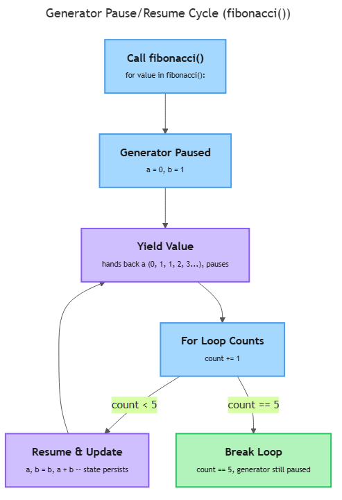

# Functional Constructs

<sub>[&#8592; Previous: 3.1 Functions](../../../../../../../content/ai_native_engineering_foundations/p2-control-structures-functions-tooling/week-3/1-functions-modules-tooling-2/3-1-functions/artifacts/reading.md)&nbsp;&nbsp;&nbsp;&nbsp;&nbsp;&nbsp;|&nbsp;&nbsp;&nbsp;&nbsp;&nbsp;&nbsp;[Go back to TOC](../../../../../../../README.md)&nbsp;&nbsp;&nbsp;&nbsp;&nbsp;&nbsp;|&nbsp;&nbsp;&nbsp;&nbsp;&nbsp;&nbsp;[Next: 3.3 Modules, Packaging & Professional Tooling &#8594;](../../../../../../../content/ai_native_engineering_foundations/p2-control-structures-functions-tooling/week-3/1-functions-modules-tooling-2/3-3-modules-packaging-professional-tooling/artifacts/reading.md)</sub>

---

## Overview

You have three everyday problems: order a list of words by length instead of alphabetically, time a slow function without littering it with `print(time.time())` calls, and produce a huge — maybe infinite — sequence of values without building the whole thing in memory first. Python solves all three with one small, reusable idea: a function is just a value, so you can pass it around, wrap one function around another, or have a function hand back its values one at a time instead of all at once. This topic covers four constructs built on that idea — lambda expressions, higher-order functions like `sorted(key=...)`, decorators, and generators — and none of them need new syntax beyond what `def`, `return`, and `*args`/`**kwargs` from Topic 3.1 were already preparing you for. _This contributes to A1 — Python Core Skills Checkpoint (due W03)._

## Key Concepts

### Lambda (anonymous) functions

A **lambda** is a small, unnamed function written on a single line: `lambda parameters: expression` — no parentheses around the parameters, no `return`, and no name unless you choose to assign one [1].

```python
square = lambda n: n * n
square(5)          # 25
```

`square` behaves exactly like `def square(n): return n * n` — the expression after the colon is returned automatically. A lambda's real value is not naming it and calling it later; it is passing it, unnamed, directly into another function that expects a function as an argument. That is the pattern the rest of this topic builds on: `sorted(words, key=lambda w: len(w))` reads as "sort `words`, and for each one, use its length as the thing to compare" [1]. A lambda can hold only a single expression — no loops, no multiple statements, no assignment. If the logic needs more than one line, write a regular `def` function instead and pass its name.

### Higher-order functions: `map`, `filter`, `sorted(key=...)`

A **higher-order function** is a function that takes another function as an argument, returns one, or both [2] — possible only because functions are values in Python, storable in a variable or a list and passable to another function exactly like a number or string.

Three higher-order functions matter here:

- **`sorted(iterable, key=...)`** returns a new, sorted list. Without `key`, items are compared directly. With `key`, Python calls your function once per item and sorts by *that result* instead of the item itself [1][2]:

```python
words = ["banana", "fig", "kiwi", "watermelon"]
sorted(words, key=lambda w: len(w))
# ['fig', 'kiwi', 'banana', 'watermelon']  -- shortest to longest
```

- **`map(function, iterable)`** applies `function` to every item and hands back the transformed results, one per input [1][2]:

```python
doubled = map(lambda n: n * 2, [1, 2, 3, 4])
list(doubled)        # [2, 4, 6, 8]
```

`map()` itself does not hand you a list — it hands you a `map` object that produces values as you ask for them. Wrapping it in `list(...)` forces it to produce everything right now. This "produce on demand" behavior is the same idea generators use below.

- **`filter(function, iterable)`** keeps only the items where `function` returns a truthy value, and drops the rest [1][2]:

```python
evens = filter(lambda n: n % 2 == 0, [1, 2, 3, 4])
list(evens)          # [2, 4]
```

`sorted(key=...)` is the one of these three you will reach for constantly — ordering results by score, by distance, by length, by any rule you can write as a one-line function. `map` and `filter` are worth recognizing when you read other people's code, but a list comprehension (a later topic) often reads more clearly for the same job. What matters now is the underlying concept: passing a small function into a built-in one to customize its behavior.

### Decorators (light introduction)

A **decorator** is a function that takes another function and returns a new function that wraps extra behavior around it, without changing the original function's code [3]. Writing `@my_decorator` directly above a `def` is shorthand for defining the function and then reassigning its name to `my_decorator(function)` [3].

```python
def shout(func):
    def wrapper(*args, **kwargs):
        result = func(*args, **kwargs)
        return result.upper()
    return wrapper

@shout
def greet(name):
    return f"hello, {name}"

greet("sam")   # "HELLO, SAM"
```

Three pieces make this work, all of them things you already have from 3.1. `shout` accepts a function (`func`) and returns a function (`wrapper`). `wrapper`, defined *inside* `shout`, is what actually replaces `greet` — calling `greet("sam")` really calls `wrapper("sam")`, which calls the original `greet` internally and does something extra with its result. And `wrapper(*args, **kwargs)` uses the exact `*args`/`**kwargs` collecting pattern from 3.1, because a decorator has to work on *any* function, regardless of how many arguments it takes.

### Generators: the `yield` keyword and lazy evaluation

A **generator function** looks like an ordinary function, except its body contains at least one `yield` statement instead of (or alongside) `return` [4]. Calling a generator function does not run its body immediately — it returns a **generator object**, and the body only starts running when you start pulling values out of it, most commonly with a `for` loop [4].

```python
def count_up_to(n):
    current = 1
    while current <= n:
        yield current
        current += 1

for value in count_up_to(5):
    print(value)
# 1 2 3 4 5
```

Each time execution reaches `yield`, the function hands out that value and *pauses* — everything about its state is frozen exactly where it stopped. When the `for` loop asks for the next value, the function wakes up right after the `yield` and keeps going until it hits `yield` again or the function ends [4]. This is **lazy evaluation**: values are produced one at a time, only when requested, instead of an entire list being built and held in memory up front [2][4].

The classic worked example is a Fibonacci generator:

```python
def fibonacci():
    a, b = 0, 1
    while True:
        yield a
        a, b = b, a + b
```

`fibonacci()` never finishes on its own — the `while True` loop runs forever — but that is fine, because nothing forces it to produce every value at once. You just take as many as you need with a `for` loop, stopping yourself once you have enough:

```python
count = 0
for value in fibonacci():
    print(value)
    count += 1
    if count == 5:
        break
# 0 1 1 2 3
```

The diagram below traces exactly this cycle. Calling `fibonacci()` creates a paused generator object holding `a = 0, b = 1`. Each pass hands back the current value of `a` through `yield`, the `for` loop's counter advances, and — unless the count has reached 5 — the generator resumes, updates `a, b = b, a + b`, and loops back around to the next `yield`.


*How calling `fibonacci()` produces a paused generator object that yields one value per resume, with `a` and `b` persisting across every pause, until the `for` loop's counter reaches 5 and breaks.*

The `break` is what stops the loop, not the generator running out — an infinite generator never runs out on its own, so it is the caller's job to decide when enough values have been produced. Try writing this as a regular function that `return`s a list, and you hit a wall immediately: a function cannot `return` an infinite list, because it would have to finish building it first, and it never would. A generator sidesteps the problem entirely by never building the whole sequence — it only ever holds the next value to produce. That is the concrete payoff of lazy evaluation: sequences that are enormous, or infinite, or simply not needed in full become usable.

## Worked Example

The canonical example for this topic is `@timer`, a decorator that measures how long a function takes to run [3]. Building it, step by step:

1. Define an outer function (`timer`) that takes one parameter: the function being decorated.
2. Inside it, define an inner function (`wrapper`) with signature `(*args, **kwargs)` so it can accept any call.
3. Inside `wrapper`, record a start time, call the original function with the same `*args, **kwargs` it received, and record an end time.
4. Report the elapsed time, then `return` the original function's result unchanged.
5. Have `timer` `return wrapper` (not call it).
6. Apply it with `@timer` directly above the `def` of the function you want timed.

```python
import time

def timer(func):
    def wrapper(*args, **kwargs):
        start = time.time()
        result = func(*args, **kwargs)
        end = time.time()
        print(f"{func.__name__} took {end - start:.4f} seconds")
        return result
    return wrapper

@timer
def slow_add(a, b):
    total = 0
    for _ in range(10_000_000):
        total += 1
    return a + b

slow_add(2, 3)
# slow_add took 0.3521 seconds
# 5
```

`slow_add` still returns `5` to its caller exactly as before — the decorator adds the timing message as a side effect without touching a single line inside `slow_add`. This is the whole appeal of decorators: behavior like timing, logging, or checking permissions can be written once and applied to any function with a one-line `@` annotation.

## In Practice

- **`sorted(..., key=lambda ...)`** is the pattern you will meet constantly with real data: ranking search results by relevance score, ordering log entries by timestamp, sorting a leaderboard by highest score first. The lambda is disposable — it exists for one call to `sorted()` and is never reused, which is exactly why it does not need a name [1].
- **Decorators** show up anywhere the same wrapping behavior needs to apply to many different functions: timing slow operations to find performance bottlenecks, logging every call for debugging, or retrying a flaky operation automatically before giving up. `@timer` is the simplest member of that family — the same wrapper structure, with different logic inside `wrapper`, covers all of them [3].
- **Generators** earn their keep whenever the full sequence would be wasteful or impossible to hold in memory at once: reading a huge file, streaming rows from a large dataset, or producing values from a sequence — like Fibonacci — that has no natural end. Lazy evaluation means the program only pays for the values it actually asks for [2][4].
- Keep lambdas to one short expression. If you need more than one line of logic, or the logic is reused in more than one place, write a named `def` function instead — it is easier to read, test, and debug.
- Reach for `sorted(key=...)` before writing custom comparison logic. It is the standard, idiomatic way to sort by a derived value.
- Always give a decorator's wrapper the signature `(*args, **kwargs)`, unless it is meant to wrap only one specific kind of function — otherwise it will break on any function whose arguments don't match exactly what you hardcoded.
- A decorator should return the wrapped function's result, not swallow it — callers of the decorated function expect the same return value they would have gotten undecorated, plus whatever side effect the decorator adds.
- Use a generator instead of building a full list whenever the sequence is large, unbounded, or only partially needed — it trades a small amount of extra care for real memory savings.

## Key Takeaways

- A lambda is a single-expression, unnamed function — useful for a one-off argument to another function, not for logic that needs a name or more than one line.
- A higher-order function accepts or returns another function; `sorted(key=...)`, `map()`, and `filter()` are the built-in examples, and `sorted(key=...)` is the one you will use most.
- A decorator is a function that wraps another function and returns the wrapper; `@decorator` syntax is shorthand for `func = decorator(func)`, and a general-purpose wrapper needs `*args, **kwargs` to accept any function's signature.
- A generator function uses `yield` instead of `return` to produce values one at a time, pausing between each `yield` and resuming exactly where it left off.
- Lazy evaluation — producing values only when asked for them — is what lets a generator represent a sequence too large, or too infinite, to ever build as a complete list.

## References

1. Real Python. "Python Lambda" — lambda syntax and use as a sort key / with map, filter, sorted. https://realpython.com/python-lambda/
2. Python Software Foundation. "Functional Programming HOWTO" — higher-order functions, map/filter, sorted(key=), generators. https://docs.python.org/3/howto/functional.html
3. Real Python. "Primer on Python Decorators" — @decorator syntax, wrapper functions, @timer-style practical use cases. https://realpython.com/primer-on-python-decorators/
4. Real Python. "Introduction to Python Generators" — generators and yield, lazy evaluation, memory efficiency vs lists. https://realpython.com/introduction-to-python-generators/

---

<sub>[&#8592; Previous: 3.1 Functions](../../../../../../../content/ai_native_engineering_foundations/p2-control-structures-functions-tooling/week-3/1-functions-modules-tooling-2/3-1-functions/artifacts/reading.md)&nbsp;&nbsp;&nbsp;&nbsp;&nbsp;&nbsp;|&nbsp;&nbsp;&nbsp;&nbsp;&nbsp;&nbsp;[Go back to TOC](../../../../../../../README.md)&nbsp;&nbsp;&nbsp;&nbsp;&nbsp;&nbsp;|&nbsp;&nbsp;&nbsp;&nbsp;&nbsp;&nbsp;[Next: 3.3 Modules, Packaging & Professional Tooling &#8594;](../../../../../../../content/ai_native_engineering_foundations/p2-control-structures-functions-tooling/week-3/1-functions-modules-tooling-2/3-3-modules-packaging-professional-tooling/artifacts/reading.md)</sub>
