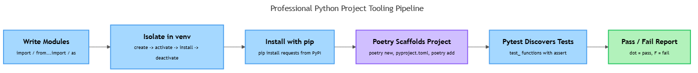

# Modules, Packaging & Professional Tooling

## Overview

Every program you have written so far has lived in a single file, built entirely from tools Python ships with — `def`, loops, `*args`, decorators. Real software does not stay that way: files get split for readability, outside code gets pulled in for features Python does not ship with, and multiple projects on one machine need their dependencies kept apart. This topic covers the plumbing that makes that possible — modules, the standard library, `pip` and virtual environments, and two tools professional Python developers reach for constantly, Poetry and Pytest — the difference between "a script that runs on my machine" and "a project someone else can clone, install, and trust." _This contributes to A1 — Python Core Skills Checkpoint (due W03)._

## Key Concepts

### Modules and imports

A **module** is just a `.py` file treated as a bundle of names — functions, variables, whatever it defines — that other files can borrow [1]. If `geometry.py` contains a function `area_of_circle`, any other file in the project can reach it by importing `geometry`, in three different forms.

Plain `import` brings in the whole module as one name, reached with dot notation:

```python
import geometry

geometry.area_of_circle(3)
```

`from ... import` pulls specific names out of a module directly into your file, so you use them without the module prefix:

```python
from geometry import area_of_circle

area_of_circle(3)
```

`import ... as` gives an imported module a different local name — most often to shorten it or avoid a clash:

```python
import geometry as geo

geo.area_of_circle(3)
```

The dot-notation requirement is called **namespacing**: every module keeps its own set of names separate from every other module's, so two files can each define `area_of_circle` without colliding [1]. Plain `import` preserves that separation; `from geometry import area_of_circle` deliberately breaks it by copying one name into your file — convenient, but you lose the reminder of where the name came from once a file has a dozen imports. A **package** extends the same idea to a directory: a folder of related modules (plus a special file marking it importable) you import as a single unit, the same way the standard library itself is organized [1].

### The standard library

Python ships with a large collection of modules that are always available, with no installation step — the **standard library** [3]. Three come up constantly:

- **`random`**: `random.random()` returns a float between 0 and 1; `random.randint(1, 6)` returns a random whole number in that inclusive range (a die roll); `random.choice([...])` picks one item at random from a sequence [3].
- **`math`**: `math.sqrt(16)` returns `4.0`; `math.floor(3.7)` rounds down to `3`; `math.pi` gives the constant `3.14159...` [3].
- **`datetime`**: `datetime.date.today()` returns today's date; `datetime.datetime.now()` returns the current date and time; subtracting two `datetime` objects gives a `timedelta` [3].

```python
import random
import math
from datetime import date

roll = random.randint(1, 6)
radius_area = math.pi * math.pow(3, 2)
today = date.today()
```

These three are not special — *hundreds* of modules like them ship free with every Python install, covering file paths, networking, and more. Before installing anything, check whether the standard library already solves the problem.

### Package management with pip

The standard library cannot cover everything — nothing ships a web framework or a client for a specific cloud API. That code is published by other developers as **packages** on the **Python Package Index (PyPI)**, and **pip** downloads and installs them into your environment [2]. `pip install requests` makes `import requests` work afterward, where it would raise `ModuleNotFoundError` before installation, since `requests` is not part of the standard library.

Installed packages are typically recorded in a `requirements.txt` file (one package, often with a version, per line) so anyone else can recreate the exact same installed set with `pip install -r requirements.txt` [2]. The distinction to hold onto: `import` only *loads* code already present somewhere Python can find it; `pip install` is the separate step that *puts* third-party code there in the first place.

### Virtual environments: why isolation matters

Plain `pip install` puts a package into your machine's one global Python installation — a problem the moment two projects need different versions of the same package (Project A needs `requests` 2.10, Project B needs 2.31; installing one globally breaks the other). A **virtual environment**, created with Python's built-in `venv` module, gives each project its own private, isolated interpreter and its own separate set of installed packages [2].

The conceptual workflow — described here rather than run live, since it depends on a real terminal — is four steps:

1. **Create**: `python -m venv env` builds a folder (often `env` or `.venv`) holding an isolated Python and package set.
2. **Activate**: running the environment's activation script (`source env/bin/activate` on macOS/Linux, `env\Scripts\activate` on Windows) makes that isolated Python the one your terminal uses.
3. **Install**: `pip install <package>` as normal — packages land inside `env`, not the global install.
4. **Deactivate** when done, returning to the system-wide Python [2].

Every serious Python project gets its own virtual environment. It is the single habit that prevents "it works on my machine," because "my machine" and "the isolated environment for this project" are deliberately kept apart.

### Poetry: initializing a project

**Poetry** wraps the ideas above into one workflow: it creates the virtual environment, tracks dependencies, and scaffolds a project's folder structure through a single command-line tool [4]. `poetry new my_project` generates a starting directory — a package folder named `my_project`, an empty `tests` folder, and a `pyproject.toml` file recording the project's name, dependencies, and metadata in one place, replacing the separate `requirements.txt` from plain pip [4].

From there, `poetry add <package>` installs a dependency and records its exact version in `pyproject.toml`; `poetry install` reads that file and recreates the exact environment on any machine; `poetry run <command>` runs a command inside the project's managed virtual environment without activating it by hand [4]. The concept to hold onto: Poetry does not replace `venv` and `pip` — it automates the same create-isolate-install pattern behind one project-aware tool.

### Pytest: writing and running a first test

**Pytest** is a testing framework: it runs small functions you write to check your code behaves as expected, and reports which passed or failed [5]. A Pytest test is an ordinary function whose name starts with `test_`, living in a file whose name also starts with `test_` (or ends with `_test.py`) — that naming convention is how Pytest *discovers* tests without you listing them anywhere [5]. Inside the function, Python's built-in `assert` statement states something that must be true; if it is not, the test fails and Pytest shows exactly what was expected versus what happened.

```python
# test_geometry.py
from geometry import area_of_circle

def test_area_of_circle():
    assert area_of_circle(0) == 0
    assert round(area_of_circle(2), 2) == 12.57
```

Running `pytest` with no arguments scans the current directory for matching files and functions, runs each one, and prints a summary — a dot for every pass, an `F` for every fail, followed by a traceback for any failure [5]. The workflow to hold onto: write a small function asserting what correct behavior looks like, name it so Pytest finds it, and let the tool run and report instead of eyeballing output yourself.

## Worked Example

The six ideas above are not separate tools — they are stages of one pipeline, from writing code to confirming it works:


*Write modules, isolate the project in a venv, install dependencies with pip, let Poetry scaffold and manage the project, then let Pytest discover and report on tests — one pipeline, six stages.*

Setting up a new project the professional way, end to end:

1. **Scaffold**: `poetry new my_project` (or manually: a folder, a `venv`, and a `requirements.txt`).
2. **Activate**: Poetry does this automatically via `poetry run`; with plain `venv` you activate it yourself.
3. **Add dependencies** as needed: `poetry add requests` (or `pip install requests` inside an activated `venv`).
4. **Write code**, splitting it into modules as it grows, importing between files with `import`, `from ... import`, or `import ... as`.
5. **Add tests**: a `tests/test_<module>.py` file per module, with `test_`-prefixed functions asserting expected behavior.
6. **Run** `pytest` (or `poetry run pytest`) before every commit to confirm nothing broke.

Applied concretely: a `dice.py` module defines `roll(sides=6)`, returning `random.randint(1, sides)`. A second file does `import dice` and calls `dice.roll()` five times. The four `venv` commands from the workflow above (create, activate, install, deactivate) isolate this mini-project from anything else on the machine. Finally, `test_dice.py` defines `test_roll()`, asserting that `dice.roll(6)` always returns a value between `1` and `6` inclusive — a Pytest test that Pytest discovers automatically because of its `test_` name, no configuration required.

## In Practice

- **Splitting a growing script into modules** — one file for data loading, one for calculations, one for output — is the first packaging decision every real project makes, well before anyone thinks about publishing anything [1].
- **`pip install <package>` plus a committed `requirements.txt`** (or Poetry's `pyproject.toml`) is how a team ensures everyone, and every deployment server, ends up with the identical dependencies [2][4].
- **A dedicated virtual environment per project is standard** because most developers run more than one Python project on the same machine at once, each with its own dependency needs [2].
- **Automated tests run through `pytest`**, often on every push to a shared repository, catch a broken function before it reaches anyone else's machine, rather than relying on manual testing [5].
- **Prefer `import module` or `from module import specific_name`** over `from module import *` — the wildcard silently pulls in every name a module defines, making it hard to tell later where a name came from.
- **Check the standard library before installing anything** — `random`, `math`, `datetime`, and hundreds of others are already there, no `pip install` needed.
- **Never install a third-party package into the global Python.** Create a virtual environment (or Poetry project) per project, every time, even for a small script.
- **Commit `requirements.txt` or `pyproject.toml`, never the environment folder itself** — the environment regenerates from that file.
- **Name test files and functions with the `test_` convention** so Pytest's discovery finds them without extra configuration, and keep each test checking one specific behavior.

## Key Takeaways

- A module is a `.py` file whose names you reuse elsewhere via `import`, `from ... import`, or `import ... as` — each form changes how you reach the imported names, not what they do.
- The standard library (including `random`, `math`, and `datetime`) ships with Python and needs no installation; `pip` is the separate tool for installing third-party packages from PyPI.
- A virtual environment gives each project its own isolated interpreter and package set, which is what prevents one project's dependencies from breaking another's.
- Poetry automates the create-environment-and-track-dependencies workflow through `poetry new`, `poetry add`, and `pyproject.toml`, rather than replacing the underlying `venv`/pip concepts.
- A Pytest test is a `test_`-named function using `assert` to check expected behavior; naming it correctly is what lets Pytest discover and run it automatically.

## References

1. Python Software Foundation. "Modules" — `import`, `from ... import`, `as`, namespacing, packages. https://docs.python.org/3/tutorial/modules.html
2. Python Software Foundation. "Virtual Environments and Packages" — `venv` create/activate/install/deactivate, `pip`, `requirements.txt`. https://docs.python.org/3/tutorial/venv.html
3. Python Software Foundation. "Brief Tour of the Standard Library" — `random`, `math`, `datetime`. https://docs.python.org/3/tutorial/stdlib.html
4. Poetry. "Basic Usage" — `poetry new`, `pyproject.toml`, `poetry add`, `poetry install`, `poetry run`. https://python-poetry.org/docs/basic-usage/
5. Pytest. "Get Started" — writing a `test_` function, `assert`, test discovery, pass/fail reporting. https://docs.pytest.org/en/stable/getting-started.html
