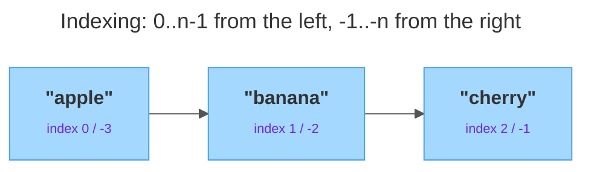

# Lists

<sub>[&#8592; Previous: 3.3 Modules, Packaging & Professional Tooling](../../../../../../../content/ai_native_engineering_foundations/p2-control-structures-functions-tooling/week-3/1-functions-modules-tooling-2/3-3-modules-packaging-professional-tooling/artifacts/reading.md)&nbsp;&nbsp;&nbsp;&nbsp;&nbsp;&nbsp;|&nbsp;&nbsp;&nbsp;&nbsp;&nbsp;&nbsp;[Go back to TOC](../../../../../../../README.md)&nbsp;&nbsp;&nbsp;&nbsp;&nbsp;&nbsp;|&nbsp;&nbsp;&nbsp;&nbsp;&nbsp;&nbsp;[Next: 4.2 Tuples &#8594;](../../../../../../../content/ai_native_engineering_foundations/p3-data-structures/week-4/1-data-structures-1/4-2-tuples/artifacts/reading.md)</sub>

---

## Overview

Almost every real program juggles *collections* of things, not single values: a shopping cart of items, the scores in a game, the rows returned from a query. A **list** is Python's everyday container for holding many values in order, in a single variable [1]. Lists are the workhorse of the language — ordered, able to hold anything, and, crucially, changeable after you create them, a property called **mutability** [2]. Master lists and you can store a batch of values, reach into it by position, carve out sub-sections, grow and shrink it, sort it, and transform it into a new list with one compact line. _This contributes to A2 — Data Structures Portfolio (due W5)._

## Key Concepts

<strong><u>Creating a list.</u></strong> A list is written as a comma-separated sequence of values inside **square brackets** `[ ]` [1]. It is a single value of type `list` that happens to contain other values — the elements — and it keeps them in the order you wrote them, an order that does not shuffle on its own [1]:

```python
fruits = ["apple", "banana", "cherry"]
numbers = [10, 20, 30, 40, 50]
mixed = ["Bob", 42, True, 3.14]   # items can be of different types
empty = []                         # a list with no items
print(type(fruits))   # <class 'list'>
print(len(fruits))    # 3  — len() gives the number of items
```

<strong><u>Indexing.</u></strong> Each element has a numbered position called its **index**. Python indexes from **zero** — the first element is at index `0`, the second at `1`, and so on — and you reach an element with the list name followed by the index in square brackets [3]. Python also supports **negative indexing**, which counts from the *end*: `-1` is the last element, `-2` the second-to-last, saving you from computing `len(list) - 1` every time [3]. Asking for an index that does not exist raises an `IndexError`; for a list of length `n`, index `0` and index `-n` are the same element. The diagram below shows both numbering schemes over the same three slots — positive indices running left-to-right and negative indices running right-to-left:



```python
fruits = ["apple", "banana", "cherry"]
print(fruits[0])   # apple  — first element
print(fruits[-1])  # cherry — last element
print(fruits[-3])  # apple  — same as fruits[0]
```

<strong><u>Slicing.</u></strong> **Slicing** pulls out a *range* of elements and returns them as a **new list**. The syntax is `list[start:stop:step]`, where `start` is included, `stop` is excluded, and `step` is how far to jump each time; `start` defaults to `0`, `stop` to `len(list)`, so `a[:]` is a full copy [3]. Two idioms are worth memorising: `a[::2]` takes every second item, and `a[::-1]` produces a reversed copy — a negative step walks backward. Because a slice always builds a *new* list, slicing never changes the original [3]:

```python
a = [0, 1, 2, 3, 4, 5, 6, 7, 8, 9]
print(a[1:5])     # [1, 2, 3, 4]     — 5 excluded
print(a[:3])      # [0, 1, 2]        — start defaults to 0
print(a[7:])      # [7, 8, 9]        — stop defaults to len(a)
print(a[::2])     # [0, 2, 4, 6, 8]  — every 2nd element
print(a[1:5:2])   # [1, 3]           — from 1 to 5, stepping by 2
print(a[::-1])    # [9, 8, ... 0]    — reversed copy
```

<strong><u>Mutability.</u></strong> Lists are **mutable** — you can change their contents after creation without making a new list. Assigning to an index replaces one element in place, and assigning to a slice replaces several at once [1]. Mutability has a consequence worth understanding early: a variable holding a list holds a *reference* to that list, not a private copy, so if two names point at the same list, a change through one is visible through the other [1][2]:

```python
colors = ["red", "green", "blue"]
colors[1] = "yellow"       # ['red', 'yellow', 'blue']
colors[0:2] = ["black", "white"]  # ['black', 'white', 'blue']

a = [1, 2, 3]
b = a            # b and a refer to the SAME list
b.append(4)
print(a)         # [1, 2, 3, 4]  — a changed too!
```

For an independent copy, slice it (`b = a[:]`) or call `a.copy()`. The takeaway: lists can be changed in place, and sharing a list means sharing its changes [1][2].

<strong><u>List methods.</u></strong> Lists carry built-in **methods** — functions attached to the list, called with the dot syntax `list.method(...)`. The everyday eight fall into three groups [1][2].

Methods that add elements:

- `append(x)` — add `x` as a single new element at the end.
- `insert(i, x)` — insert `x` so it lands at index `i`, shifting later items right.
- `extend(iterable)` — add *each* item of another sequence to the end.

Methods that remove elements:

- `remove(x)` — delete the first element equal to `x` (raises `ValueError` if absent).
- `pop(i)` — remove and **return** the element at index `i`; with no argument, removes and returns the last element.
- `clear()` — remove every element, leaving `[]`.

Methods that search and count:

- `index(x)` — return the index of the first element equal to `x` (raises `ValueError` if absent).
- `count(x)` — return how many times `x` appears.

```python
nums = [1, 2, 3]
nums.append(4)        # [1, 2, 3, 4]
nums.insert(0, 99)    # [99, 1, 2, 3, 4]
nums.extend([5, 6])   # [99, 1, 2, 3, 4, 5, 6]
```

Note the difference between `append` and `extend`: `nums.append([5, 6])` adds the *list* `[5, 6]` as one nested element, whereas `extend` unpacks it into individual elements [2]. All of `append`, `insert`, `extend`, `remove`, `pop`, and `clear` change the list *in place* and rely on mutability; `index` and `count` only read from it [1][2].

<strong><u>Iteration.</u></strong> Because a list is ordered and iterable, a `for`-loop visits each element in turn. When you also need the position, pair the loop with `range(len(...))`; otherwise iterate directly for the values. Walking the items, testing each with a conditional, and accumulating a result is the most common thing you will do with a list — and the foundation the comprehension compresses into one line [1]:

```python
for fruit in fruits:
    print(f"I like {fruit}")

for i in range(len(fruits)):
    print(f"{i}: {fruits[i]}")
```

<strong><u>Sorting.</u></strong> There are two ways to order a list, and the difference matters [2]:

- **`list.sort()`** is a *method* that sorts the list **in place** and returns `None` — the original is rearranged.
- **`sorted(list)`** is a *built-in function* that returns a **new** sorted list and leaves the original untouched.

Both accept the same two keyword arguments [2]:

- **`reverse=True`** sorts from largest to smallest (descending).
- **`key=`** takes a function applied to each element to decide the order; the list is sorted by the *result* of that function, not the element itself.

```python
nums = [3, 1, 2]
nums.sort()                 # nums is now [1, 2, 3]; sort() returns None
result = sorted([3, 1, 2])  # result == [1, 2, 3]; original unchanged

words = ["banana", "apple", "kiwi"]
print(sorted(words, reverse=True))  # ['kiwi', 'banana', 'apple']
print(sorted(words, key=len))       # ['kiwi', 'apple', 'banana'] — by length
```

A common mistake is writing `nums = nums.sort()`, which assigns `None` because `sort()` returns nothing. Use the method when you don't need the original order back, the function when you do. The `key` function can be `len` or any function you define with `def` that takes one element and returns a comparable value [2].

<strong><u>Nested lists.</u></strong> A list element can itself be a list, giving you a **nested list** — a natural way to represent a grid, a table, or rows of data [2]. The first index selects a row; the second reaches inside that row. To visit every cell, nest one loop inside another. Each inner list is a full-fledged list with all the methods and slicing you already know:

```python
grid = [[1, 2, 3], [4, 5, 6], [7, 8, 9]]
print(grid[0])       # [1, 2, 3]  — the first row (a list)
print(grid[0][2])    # 3          — row 0, then column 2

for row in grid:
    for value in row:
        print(value, end=" ")
    print()
```

<strong><u>Comprehensions.</u></strong> A **list comprehension** builds a new list from an existing sequence in a single expression, replacing the "create an empty list, loop, append" pattern with one line [1][2]. Read `[expression for item in iterable]` left to right: "the expression, for each item in the iterable." The part before `for` is what each new element becomes. A comprehension can map, filter, or do both:

- **Map** — transform every item: `[n * n for n in range(5)]` gives `[0, 1, 4, 9, 16]`.
- **Filter** — add an `if` clause to keep only items that pass a condition: `[n for n in range(10) if n % 2 == 0]` gives `[0, 2, 4, 6, 8]`.
- **Both at once** — transform *and* select: `[n * 2 for n in nums if n % 2 == 0]` gives `[4, 8, 12]`.

Comprehensions are idiomatic Python — shorter, faster to read once you know the pattern, and they always return a fresh list without touching the source [2].

## Worked Example

Start with a week of temperatures and work through the core operations end to end:

```python
temps = [68, 71, 65, 74, 69, 72, 66]

# 1. Indexing (positive + negative) and a step slice
print(temps[0])     # 68  — first reading
print(temps[-1])    # 66  — last reading
print(temps[::2])   # [68, 65, 69, 66]  — every other day

# 2. Grow the list, then find the three warmest days
temps.append(70)
print(sorted(temps, reverse=True)[:3])  # [74, 72, 71] — sort descending, slice top 3

# 3. Filter with a comprehension, then map each reading to a label
warm = [t for t in temps if t > 70]           # [71, 74, 72]
labels = [f"Day reading: {t}F" for t in temps] # one f-string per element
```

Step 1 reaches single values by position — `temps[0]` for the first, `temps[-1]` for the last — and `temps[::2]` slices out every other day as a new list. Step 2 uses `append` to grow the list in place, then composes `sorted(..., reverse=True)` with a `[:3]` slice to rank and take the top three without disturbing `temps`. Step 3 shows the two comprehension shapes: an `if` clause filters to readings above 70, and a mapping expression turns each reading into a label string with an `f-string` [1][2].

## In Practice

Where lists show up, and the reliable patterns to reach for:

- **Accumulating results.** Start with `results = []`, loop over some input, and `append` each computed value — the pattern behind reports, parsed files, and API responses [1].
- **Filtering and transforming data.** A single comprehension like `[row for row in rows if row[0] == "active"]` selects matching records; `[price * 1.1 for price in prices]` reprices a column — the everyday shape of data cleanup [2].
- **Ranking and top-N.** `sorted(scores, reverse=True)[:3]` composes sorting and slicing to take the top three.
- **A stack.** `append` to push and `pop()` to remove the most recent item gives a last-in-first-out stack with no extra machinery [2].
- **Tabular data.** A nested list (list of rows) is the simplest in-memory table.

Common do/don't when working with lists:

- **Prefer a comprehension** over the empty-list-plus-`append` loop when simply mapping or filtering — clearer, and it returns a new list.
- **Don't write `x = mylist.sort()`** — `sort()` returns `None`. Call it on its own line, or use `sorted(mylist)` if you want a value to assign.
- **Remember lists are shared by reference** — `b = a` does not copy; use `a[:]` or `a.copy()` for an independent list.
- **Match the remover to what you know** — `remove(value)` versus `pop(index)`; guard with `if value in mylist:` before `remove` to avoid a `ValueError`.
- **Use negative indices** (`a[-1]`) instead of `a[len(a)-1]` — shorter and less error-prone.

## Key Takeaways

- A list is an ordered, mutable collection written with `[ ]`; elements are reached by index, with `0` as the first and `-1` as the last.
- Slicing (`a[start:stop:step]`) returns a *new* list; `a[::2]` takes every second item and `a[::-1]` reverses.
- In-place methods (`append`, `insert`, `extend`, `remove`, `pop`, `clear`) change the list itself and return `None`, while `sorted()` and slices produce new lists.
- `sort()` reorders in place; `sorted()` returns a new sorted list — both accept `reverse=` and `key=`.
- A list comprehension maps and/or filters in one expression, replacing the empty-list-loop-`append` pattern; a nested list models two-dimensional data.

## References

1. W3Schools — *Python Lists*. https://www.w3schools.com/python/python_lists.asp
2. Python Software Foundation — *Data Structures* (Python Tutorial). https://docs.python.org/3/tutorial/datastructures.html
3. freeCodeCamp — *Python List Slicing and Indexing*.

---

<sub>[&#8592; Previous: 3.3 Modules, Packaging & Professional Tooling](../../../../../../../content/ai_native_engineering_foundations/p2-control-structures-functions-tooling/week-3/1-functions-modules-tooling-2/3-3-modules-packaging-professional-tooling/artifacts/reading.md)&nbsp;&nbsp;&nbsp;&nbsp;&nbsp;&nbsp;|&nbsp;&nbsp;&nbsp;&nbsp;&nbsp;&nbsp;[Go back to TOC](../../../../../../../README.md)&nbsp;&nbsp;&nbsp;&nbsp;&nbsp;&nbsp;|&nbsp;&nbsp;&nbsp;&nbsp;&nbsp;&nbsp;[Next: 4.2 Tuples &#8594;](../../../../../../../content/ai_native_engineering_foundations/p3-data-structures/week-4/1-data-structures-1/4-2-tuples/artifacts/reading.md)</sub>