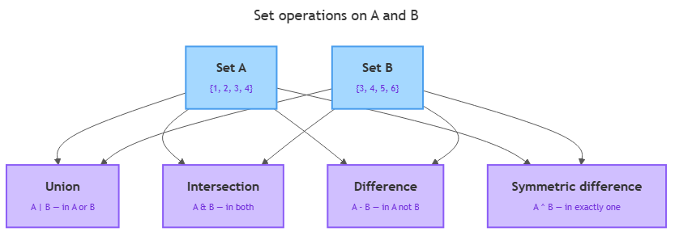

# Sets

<sub>[&#8592; Previous: 4.2 Tuples](../../../../../../../content/ai_native_engineering_foundations/p3-data-structures/week-4/1-data-structures-1/4-2-tuples/artifacts/reading.md)&nbsp;&nbsp;&nbsp;&nbsp;&nbsp;&nbsp;|&nbsp;&nbsp;&nbsp;&nbsp;&nbsp;&nbsp;[Go back to TOC](../../../../../../../README.md)&nbsp;&nbsp;&nbsp;&nbsp;&nbsp;&nbsp;|&nbsp;&nbsp;&nbsp;&nbsp;&nbsp;&nbsp;[Next: 5.2 Dictionaries &#8594;](../../../../../../../content/ai_native_engineering_foundations/p3-data-structures/week-5/1-data-structures-2/5-2-dictionaries/artifacts/reading.md)</sub>

---

## Overview

You already have lists and tuples, and both keep every item you put in — duplicates and all — and both remember order. But a lot of real data work is not about order at all; it is about *which distinct things are present* and *whether two collections overlap*: "Which unique tags did users apply?" "Which emails appear in both mailing lists?" A **set** is Python's built-in answer — think of it as "like a list, but unordered and with no duplicates" [1]. Reaching for a set instead of a hand-rolled list loop is exactly the kind of judgment that separates clean code from slow, brittle code. _This contributes to A2 — Data Structures Portfolio (due W5), which asks you to choose the right data structure for a data-handling task._

## Key Concepts

**What a set is.** A set is an *unordered collection of unique, immutable elements* [1][3]. Three words carry the weight:

- **Unordered** — a set does not track position. There is no `my_set[0]`; indexing and slicing simply do not apply, and print order can change between runs [2].
- **Unique** — a set never holds two equal elements. This is the *uniqueness guarantee*, and it is the whole point.
- **Immutable elements** — every item must itself be immutable (hashable). Numbers, strings, and tuples are fine; a list is not, and Python raises `TypeError` if you try to store one [3]. The set *itself* is mutable, but each element must be an unchangeable value.

Placed against the structures you already know:

| | List (4.1) | Tuple (4.2) | Set (here) |
|---|---|---|---|
| Ordered / indexable | yes | yes | **no** |
| Allows duplicates | yes | yes | **no** |
| Mutable container | yes | no | yes |
| Elements must be immutable | no | no | **yes** |
| Written with | `[ ]` | `( )` | `{ }` or `set()` |

Read the "no" column top to bottom and you have the definition at a glance. Everything about how you *use* a set — iterating with a `for` loop, testing with `in`, building with a comprehension — is deliberately the same as lists and tuples. The novelty is entirely in *what a set promises*, not in how you type it.

**Creating sets and the uniqueness guarantee.** Write a set with curly braces, or build one from any iterable with `set()` [1][2]. Duplicates collapse *at construction* — there is no way to switch it off [1]:

```python
digits = {1, 2, 3, 2, 1}
print(digits)          # {1, 2, 3}  — the repeats are gone
letters = set("hello")
print(letters)         # {'h', 'e', 'l', 'o'} — one 'l', in some order
```

This gives the most common one-liner: **de-duplicate a list** with `list(set(names))` — clean, but it *discards order*. One trap: `{}` is an **empty dictionary**, not an empty set; use `set()` for an empty set [1][3].

**Membership testing.** The headline query is "is this element present?" — the same `in` operator you already use [2]:

```python
colors = {"red", "green", "blue"}
print("red" in colors)         # True
print("purple" not in colors)  # True
```

**The four set operations.** This is where sets earn their place. Each operation has two spellings: a **method** (accepts any iterable) and an **operator** (both sides must be sets) [1][3]. They mean the same thing.


*How union, intersection, difference, and symmetric difference derive from two sets A={1,2,3,4} and B={3,4,5,6}.*

Given `a = {1, 2, 3, 4}` and `b = {3, 4, 5, 6}`:

- **Union** (`a | b`, `a.union(b)`) — everything in *either* set: `{1, 2, 3, 4, 5, 6}` [1][3].
- **Intersection** (`a & b`, `a.intersection(b)`) — only elements in *both*, i.e. the overlap: `{3, 4}` [1][3].
- **Difference** (`a - b`, `a.difference(b)`) — elements in the first but *not* the second: `{1, 2}`. Order matters, since `b - a` is `{5, 6}` [1][3].
- **Symmetric difference** (`a ^ b`, `a.symmetric_difference(b)`) — elements in *exactly one* set: `{1, 2, 5, 6}` [1][3].

All four return a **new** set and leave the originals untouched, so you can chain them: `(a | b) - c` [1]. The operator-versus-method choice is the one place the spellings genuinely diverge [3]: the **operator requires a set on both sides** (`a & [3, 4]` raises `TypeError`), while the **method iterates any iterable** (`a.intersection([3, 4])` works). Real data usually arrives as a list, so the method form lets you compare without a `set()` conversion.

**In-place update forms.** Each operation also has an **in-place** form that *modifies the left set* instead of returning a new one [1][3]:

- **Union**: `s |= t` or `s.update(t)` — add everything in `t`.
- **Intersection**: `s &= t` or `s.intersection_update(t)` — keep only what is also in `t`.
- **Difference**: `s -= t` or `s.difference_update(t)` — drop everything in `t`.
- **Symmetric difference**: `s ^= t` or `s.symmetric_difference_update(t)` — keep what is in exactly one.

Use these when **accumulating into one set over time**: `all_seen |= batch` is clearer and cheaper than `all_seen = all_seen | batch` because it avoids allocating a new set each round.

**Subset, superset, and disjoint relations.** Beyond combining sets, you often need to *compare* them, each relation available as operator and method [1][3]:

- **Subset** (`<=`, `issubset`) — is every element of the left set also in the right? `{1,2} <= {1,2,3,4}` is `True`.
- **Superset** (`>=`, `issuperset`) — the mirror: does the left contain every element of the right?
- **Proper subset/superset** (`<`, `>`) — add the requirement that the sets are *not equal*; `small < small` is `False`.
- **Disjoint** (`isdisjoint`, no operator) — do the two sets share *no* elements at all?

These return `True`/`False`, so they read naturally inside an `if` — for example, `if required.issubset(user_has):` to check permissions.

**Mutating a set.** A set is mutable, so you can change it after creation [1][2]:

- **`add(x)`** — insert one element; if already present, nothing happens [2].
- **`remove(x)`** — delete `x`; raises `KeyError` if `x` is absent [1].
- **`discard(x)`** — delete `x`; does nothing (no error) if `x` is absent [1].

Rule of thumb: use `discard` when you just want the element gone, and `remove` when its absence would be a genuine bug you want to hear about.

**frozenset — the immutable set.** A `frozenset` is a set whose contents can never change after creation [1][3] — set is to frozenset as list is to tuple. It supports every non-mutating operation but has no `add`/`remove`/`update`. The key payoff mirrors tuple immutability: **because a `frozenset` cannot change, it is hashable, so it can be an element of another set** [3]. A regular `set` cannot go inside a set.

**Why set membership is fast — hashing.** When you write `x in my_list`, Python compares `x` against each element in turn — up to *n* comparisons for *n* items, a linear scan (O(n)). A set stores each element in a location computed from its **hash**, so `x in my_set` hashes `x`, jumps straight there, and checks only that spot — roughly *constant* time, O(1), no matter how big the set is [1]. This is exactly why elements must be hashable: the hash must stay stable while the element sits in the set. Any time you test membership **repeatedly**, converting a list to a set once, up front, is often the single highest-impact change you can make.

**Set comprehension.** A set comprehension is a list comprehension with curly braces instead of square brackets; the result is unordered and de-duplicated [1][3]. It shines at de-dup-while-transforming:

```python
raw_names = ["Ana", "ANA", "ana", "Ben", "BEN"]
distinct = {name.lower() for name in raw_names}   # {"ana", "ben"}
```

The optional `if` filter carries straight over from list comprehensions: `{x for x in nums if x % 2 == 0}`.

## Worked Example

Find the tags shared by two articles, the tags unique to the first, and the full tag vocabulary:

```python
tags_a = {"python", "data", "sets", "python"}   # dup collapses to one
tags_b = {"data", "sql", "sets"}

shared   = tags_a & tags_b     # {"data", "sets"}   — in both
only_a   = tags_a - tags_b     # {"python"}         — first only
all_tags = tags_a | tags_b     # {"python", "data", "sets", "sql"}
one_only = tags_a ^ tags_b     # {"python", "sql"}  — in exactly one
```

Four readable expressions replace four hand-written loops. If instead you were *building up* a combined vocabulary across many articles, the in-place form is cleaner:

```python
vocabulary = set()
for article_tags in all_articles:       # each is a list of tags
    vocabulary |= set(article_tags)      # accumulate into one running set
# or equivalently: vocabulary.update(article_tags)  — no set() needed
```

That readability, plus the automatic uniqueness, is why sets are the correct structural choice here — and demonstrating that judgment is exactly what A2 asks for.

## In Practice

Sets show up constantly, almost always for one of three jobs — and in each the deciding factor is uniqueness, membership speed, or overlap:

- **De-duplication.** Log processing and import pipelines funnel a messy list through `set()` to get distinct values: `unique = set(rows)` replaces a duplicate-checking loop. When you must transform while de-duplicating, a set comprehension does both: `{e.strip().lower() for e in raw_emails}`.
- **Fast "have I seen this?" tracking.** Crawlers and cycle detection keep a `seen = set()` and check `if item in seen` before processing — fast even at millions of entries (§ hashing). If `seen` were a list, that check inside a loop would turn the whole job quadratic.
- **Finding overlap and uniques.** Comparing "roles a user has" against "roles an action needs" is an intersection; "which required roles are missing" is a difference; "does the user have everything?" is a subset check — one or two lines instead of nested loops.

A quick decision procedure:

- Care about order, position, or preserved duplicates? Use a **list**.
- Do duplicates carry meaning (counting occurrences)? A plain set loses that — keep a list; a dedicated counting tool arrives later this week.
- Is the question "which distinct items?", "is X present?", or "how do these overlap?" Use a **set**.
- Need the set fixed, or living inside another set? Use a **`frozenset`**.

A few guardrails: prefer `discard` over `remove` unless a missing element is a bug; use `set()`, never `{}`, for an empty set; do not store lists in a set (convert to a tuple or `frozenset`); and do not rely on iteration order — sort explicitly with `sorted(my_set)` if you need stability.

## Key Takeaways

- A set is an **unordered collection of unique, immutable elements**; the uniqueness guarantee removes duplicates automatically at construction.
- Sets are the right choice for **membership testing, de-duplication, and overlap** — not for ordered or position-based data; A2 rewards making that call explicitly.
- The four operations are **union (`|`), intersection (`&`), difference (`-`), and symmetric difference (`^`)**, each with a method form that accepts any iterable and an **in-place** variant (`|=`, `&=`, `-=`, `^=`) that mutates the left set.
- **Subset/superset/disjoint** relations (`<=`, `>=`, `<`, `>`, `issubset`, `issuperset`, `isdisjoint`) compare whether one set sits inside another or whether two share nothing.
- **Set membership (`in`) is roughly O(1) via hashing**, staying fast at any size, while list membership is a linear scan that slows as the list grows.
- A **`frozenset`** is the immutable set (set is to frozenset as list is to tuple); being hashable, it can itself be an element of another set. A **set comprehension** is a list comprehension with curly braces — unordered and de-duplicated.

## References

1. Real Python — *Sets in Python*. https://realpython.com/python-sets/
2. W3Schools — *Python Sets*. https://www.w3schools.com/python/python_sets.asp
3. Python Documentation — *Data Structures (Sets)*. https://docs.python.org/3/tutorial/datastructures.html

---

<sub>[&#8592; Previous: 4.2 Tuples](../../../../../../../content/ai_native_engineering_foundations/p3-data-structures/week-4/1-data-structures-1/4-2-tuples/artifacts/reading.md)&nbsp;&nbsp;&nbsp;&nbsp;&nbsp;&nbsp;|&nbsp;&nbsp;&nbsp;&nbsp;&nbsp;&nbsp;[Go back to TOC](../../../../../../../README.md)&nbsp;&nbsp;&nbsp;&nbsp;&nbsp;&nbsp;|&nbsp;&nbsp;&nbsp;&nbsp;&nbsp;&nbsp;[Next: 5.2 Dictionaries &#8594;](../../../../../../../content/ai_native_engineering_foundations/p3-data-structures/week-5/1-data-structures-2/5-2-dictionaries/artifacts/reading.md)</sub>
