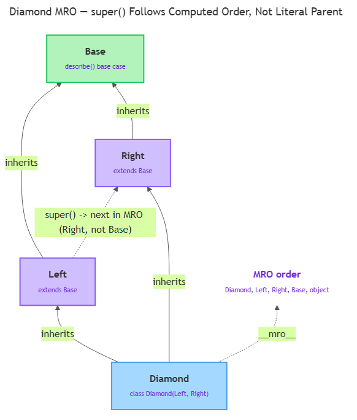

# Inheritance & Encapsulation

<sub>[&#8592; Previous: 6.1 Object-Oriented Foundations](../../../../../../../content/ai_native_engineering_foundations/p4-classes-objects/week-6/1-classes-objects/6-1-object-oriented-foundations/artifacts/reading.md)&nbsp;&nbsp;&nbsp;&nbsp;&nbsp;&nbsp;|&nbsp;&nbsp;&nbsp;&nbsp;&nbsp;&nbsp;[Go back to TOC](../../../../../../../README.md)&nbsp;&nbsp;&nbsp;&nbsp;&nbsp;&nbsp;|&nbsp;&nbsp;&nbsp;&nbsp;&nbsp;&nbsp;[Next: 6.3 Special Methods & Dataclasses &#8594;](../../../../../../../content/ai_native_engineering_foundations/p4-classes-objects/week-6/1-classes-objects/6-3-special-methods-dataclasses/artifacts/reading.md)</sub>

---

## Overview

6.1 left you with a `Task` class (`name`, `priority`, `done`, `mark_complete()`, `describe()`) and a promise: a `RegulatoryTask` would come along later that extends `Task` instead of copying it. This topic keeps that promise. **Inheritance** is Python's mechanism for saying "this class is a `Task`, plus a little more," so that a change to `Task` never has to be manually re-applied to every class built on top of it. The same idea scales past one level — a `Student` is a `Person`, and a `GraduateStudent` is a `Student` — and once classes stack that way, two more questions become unavoidable: how do you call up to a specific ancestor's version of a method (`super()`), and what happens if a class has more than one direct ancestor (Method Resolution Order)? This topic also covers **encapsulation** — the naming conventions Python gives you to signal which attributes are internal to a class.

_This contributes to A3 — Python Foundations Diagnostic (due W8): the diagnostic assumes you can read and extend a class hierarchy, not just write one from scratch._

## Key Concepts

### Single-level inheritance: a subclass extends a superclass

A **subclass** (child/derived class) is defined in terms of another class, its **superclass** (base/parent class), using `class Subclass(Superclass):` [1]. The subclass automatically gets every attribute-setting and method the superclass has:

```python
class Task:
    def __init__(self, name, priority):
        self.name = name
        self.priority = priority
        self.done = False

    def mark_complete(self):
        self.done = True

    def describe(self):
        return f"{self.name} ({self.priority}) - done={self.done}"


class RegulatoryTask(Task):
    pass
```

Even with only `pass` in its body, `RegulatoryTask("File quarterly report", "high")` works immediately. Python looks for `__init__` on `RegulatoryTask`, finds nothing, walks up to `Task`, and runs `Task.__init__` there — binding the new object as `self` and assigning `name`, `priority`, `done`. `mark_complete()` is found and run the same way. Nothing about inheriting a method requires rewriting it; the subclass just doesn't define its own version, so lookup continues upward.

`isinstance(rt, Task)` returns `True` — `rt` is usable anywhere a `Task` is expected. `issubclass(RegulatoryTask, Task)` is the same check at the class level. `type(rt)` still reports `RegulatoryTask`, never `Task` — `type()` (from 1.2) always reports the exact class an object was built from.

**Overriding** happens when a subclass defines its own version of a method the superclass already has; since lookup checks the instance's own class first, the subclass's version wins:

```python
class RegulatoryTask(Task):
    def describe(self):
        return f"[REGULATED] {self.name} ({self.priority}) - done={self.done}"
```

But `RegulatoryTask` still needs a `regulation_code` that `Task` doesn't have. Overriding `__init__` by re-typing `Task.__init__`'s body works, but any future change to `Task.__init__` won't propagate to the copy — exactly the duplication problem `super()` exists to solve.

### `super()`: extending behaviour across multiple levels

`super()`, called inside a subclass method, is a proxy for "whatever comes next in the hierarchy," letting you call the superclass's version without naming it explicitly [1][2]:

```python
class RegulatoryTask(Task):
    def __init__(self, name, priority, regulation_code):
        super().__init__(name, priority)
        self.regulation_code = regulation_code

    def describe(self):
        base_description = super().describe()
        return f"[{self.regulation_code}] {base_description}"
```

`super().__init__(name, priority)` runs `Task.__init__` on the object under construction, setting `name`/`priority`/`done`; control returns and `RegulatoryTask.__init__` adds only `regulation_code`. `describe()` follows the same pattern for an ordinary method: `super().describe()` builds the base string, and `RegulatoryTask.describe` wraps it with a prefix. This is **extending** — building on the superclass's return value — as distinct from the plain overriding above.

The pattern holds across more than two levels, and each level only needs to know about the level directly above it:

```python
class Student(Person):
    def __init__(self, name, age, email, student_id):
        super().__init__(name, age, email)
        self.student_id = student_id

    def greet(self):
        return f"{super().greet()} I'm a student, ID {self.student_id}."


class GraduateStudent(Student):
    def __init__(self, name, age, email, student_id, thesis_title):
        super().__init__(name, age, email, student_id)
        self.thesis_title = thesis_title

    def greet(self):
        return f"{super().greet()} My thesis is '{self.thesis_title}'."
```

Building a `GraduateStudent` calls three constructors in order — `Person.__init__` first (setting `name`/`age`/`email`), then `Student.__init__` (adding `student_id`), then `GraduateStudent.__init__` (adding `thesis_title`) — each only calling `super().__init__()` once, with no idea how many levels sit above it. `greet()` chains the same way: calls run outward from `GraduateStudent` to `Student` to `Person`, but the base string returns back through each wrapper, so the final sentence carries all three contributions.

Attribute lookup follows the same order but starts in a different place. `gs.species` isn't in any instance's `__dict__` (no `__init__` in the chain ever set it), so Python walks the classes — `GraduateStudent`, then `Student`, then `Person` — and finds `species = "Homo sapiens"` defined as a class attribute on `Person`. Contrast `gs.name`: the search never leaves the instance dictionary, because `Person.__init__` assigned `self.name` directly. This is 6.1's rule — instance attributes shadow class attributes — extended across every level of a chain [1].

### Method Resolution Order and the diamond problem

Every example so far is a **single-inheritance chain** — one direct base per class — so `super()` has only one place to go. **Multiple inheritance** (`class Sub(BaseA, BaseB):`) raises a real question: if `BaseA` and `BaseB` both define the same method, which does `super()` find first? Python answers this with the **Method Resolution Order (MRO)** — a fixed order over every class in the hierarchy, computed once when the subclass is defined, via an algorithm called C3 linearization [1][3]. You rarely compute an MRO by hand; you need to know it exists and how to inspect it with `ClassName.__mro__`.

The **diamond problem** makes MRO visible: `Left` and `Right` both extend `Base`, and `Diamond` extends both `Left` and `Right` [3].


*Diamond, Left, Right, and Base form a diamond; `super()` inside `Left` resolves to `Right` (the next class in `Diamond.__mro__`), not straight to `Base`.*

`Diamond.__mro__` is `(Diamond, Left, Right, Base, object)`. Calling `d.describe()`: `Diamond` defines nothing, so lookup lands on `Left.describe`, which calls `super().describe()` — and this is the detail that trips people up. `super()` inside `Left` does not mean "go to `Base`." It means "continue to whatever's next in the MRO," which is `Right`, not `Base`. `Right.describe` runs, its own `super().describe()` continues to `Base`, and the result — `"Left -> Right -> Base: example"` — assembles back up the chain [2][3]. This is the core lesson: `super()` always means "the next class in the computed MRO," never "my literal parent." That's exactly what let the `Person → Student → GraduateStudent` chain work without any class knowing what sat above its immediate base. Multiple inheritance and the full C3 algorithm are topics for later coursework; what matters here is recognizing the diamond shape and knowing `__mro__` exists to inspect it [1][2][3].

### Encapsulation: underscores and name mangling

**Encapsulation** controls which parts of an object's state outside code may rely on versus treat as internal detail. Python has no `private` keyword — it uses two naming conventions, one purely social and one with a real mechanism behind it [1].

A **single leading underscore** (`_name`) is convention only: "internal use — don't rely on this from outside code." Python does not enforce it; `t1._internal_id` reads without error [1].

A **double leading underscore** (`__name`) triggers **name mangling**: Python rewrites `self.__pin` inside a class body to `self._ClassName__pin`, using the literal class name [1]:

```python
class SecureAccount:
    def __init__(self, owner_name, pin):
        self.owner_name = owner_name
        self.__pin = pin

    def verify_pin(self, attempt):
        return attempt == self.__pin
```

`acct.__pin` raises `AttributeError` — that exact name was never created — but `acct._SecureAccount__pin` reaches it directly, proving it's an ordinary attribute under a rewritten name. The real purpose is **collision avoidance across a hierarchy**, not secrecy: if `Base.__init__` sets `self.__secret` and a `Derived(Base)` subclass also sets `self.__secret`, mangling turns these into two separate attributes, `_Base__secret` and `_Derived__secret`, so neither class's methods can accidentally clobber the other's internal state [1]. Default to single underscore; reach for double underscore specifically when a subclass reusing the same name would cause a real bug.

## Worked Example

Building `RegulatoryTask` from `Task`, end to end:

```python
class Task:
    def __init__(self, name, priority):
        self.name = name
        self.priority = priority
        self.done = False

    def mark_complete(self):
        self.done = True

    def describe(self):
        return f"{self.name} ({self.priority}) - done={self.done}"


class RegulatoryTask(Task):
    def __init__(self, name, priority, regulation_code):
        super().__init__(name, priority)
        self.regulation_code = regulation_code

    def describe(self):
        base_description = super().describe()
        return f"[{self.regulation_code}] {base_description}"


rt = RegulatoryTask("File quarterly report", "high", "GDPR-7")
rt.mark_complete()
print(rt.describe())
# [GDPR-7] File quarterly report (high) - done=True
print(isinstance(rt, Task))              # True
print(issubclass(RegulatoryTask, Task))  # True
```

Trace it step by step. First, decide what's shared and what's new: `name`/`priority`/`done` stay on `Task`; only `regulation_code` is new to `RegulatoryTask`. Second, `class RegulatoryTask(Task):` fixes `RegulatoryTask.__mro__` at `(RegulatoryTask, Task, object)` the instant it's defined [1][3] — that's why the earlier `pass`-only version already worked. Third, `super().__init__(name, priority)` resolves by finding `RegulatoryTask`'s position in its own MRO and calling the `__init__` belonging to whatever comes immediately after — here, `Task.__init__` [1][2]. Fourth, `describe()` is overridden to extend rather than replace: `super().describe()` produces the base string, and `RegulatoryTask` wraps it with the regulation code.

Finally, verify with `isinstance()`, `issubclass()`, and `type()`. `isinstance(rt, Task)` reports `True` because Python checks whether `Task` appears anywhere in `RegulatoryTask`'s full MRO, not just whether it's the single immediate base [1][3]. `type(rt)` still reports `RegulatoryTask` exactly — `type()` never consults the MRO, it only reports the exact class recorded at construction time. This last check catches the easy mistake of forgetting to list the superclass in the `class` line at all, which silently produces a class with no relationship to the intended one.

## In Practice

- **Web frameworks and GUI toolkits** model shared plumbing this way: a `TextField`/`IntegerField` both extend a shared `Field` base; a `Button`/`Checkbox` both extend a shared `Widget` base. Each subclass overrides only what's genuinely different.
- **Exception hierarchies** are a clean real-world use of the same `super().__init__()` pattern: `MissingFieldError(ValidationError)` extends `ValidationError(Exception)`, and `isinstance(some_error, ValidationError)` reports `True` for either, without checking every specific type by name.
- **ORMs** (object-relational mappers) ask every model class to extend one shared `Model` base handling save/load plumbing, so each specific model (`User`, `Product`) only declares its own fields and extends `save()` via `super()`.
- **Mixins** — small classes meant purely to be combined via multiple inheritance, each contributing one focused piece of behaviour (logging, serialization, timestamping) — are the most common legitimate use of multiple inheritance; Python's MRO ensures each mixin's `super()` call hands off correctly to the next one.
- **Published libraries** expose single-underscore attributes to signal "this might change between versions without warning" — the same convention from Key Concepts, applied at the scale of a whole API.
- Best practice: call `super().__init__()` first in a constructor, before assigning new attributes; use `super()` rather than a superclass's literal name, since a future refactor could insert a class in between; keep hierarchies to two or three levels; reach for multiple inheritance only for narrow mixins; and inherit only where an actual "is-a" relationship genuinely holds.

## Key Takeaways

- A subclass (`class Sub(Super):`) inherits every attribute-setting and method automatically; it only needs to define what's new or different.
- `super()` calls the next class in the object's Method Resolution Order — not necessarily a hardcoded parent — letting a subclass extend inherited logic instead of duplicating it, across any number of chained levels.
- MRO is the fixed order Python searches classes in, computed once per class definition; it matters most once a class has more than one direct base (the diamond problem), and is inspectable via `ClassName.__mro__`.
- A single leading underscore (`_name`) is a non-enforced convention meaning "internal use only"; a double leading underscore (`__name`) triggers real name mangling to `_ClassName__name`, preventing attribute collisions across a hierarchy — not providing security.
- `isinstance()` and `issubclass()` test "is-a" relationships created by inheritance; `type()` still reports the exact class an object was built from.

## References

[1] Python Software Foundation. "Classes." *The Python Tutorial*, sections 9.5–9.6. https://docs.python.org/3/tutorial/classes.html

[2] Real Python. "Supercharge Your Classes With Python super()." https://realpython.com/python-super/

[3] DataCamp. "The Diamond Problem in Python." https://www.datacamp.com/tutorial/diamond-problem-in-python

---

<sub>[&#8592; Previous: 6.1 Object-Oriented Foundations](../../../../../../../content/ai_native_engineering_foundations/p4-classes-objects/week-6/1-classes-objects/6-1-object-oriented-foundations/artifacts/reading.md)&nbsp;&nbsp;&nbsp;&nbsp;&nbsp;&nbsp;|&nbsp;&nbsp;&nbsp;&nbsp;&nbsp;&nbsp;[Go back to TOC](../../../../../../../README.md)&nbsp;&nbsp;&nbsp;&nbsp;&nbsp;&nbsp;|&nbsp;&nbsp;&nbsp;&nbsp;&nbsp;&nbsp;[Next: 6.3 Special Methods & Dataclasses &#8594;](../../../../../../../content/ai_native_engineering_foundations/p4-classes-objects/week-6/1-classes-objects/6-3-special-methods-dataclasses/artifacts/reading.md)</sub>
