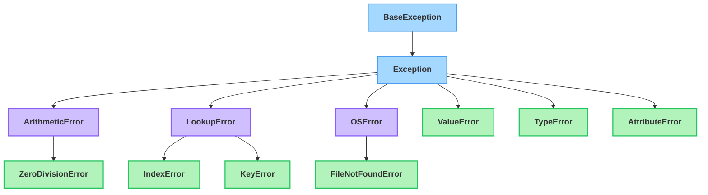

# Errors & Exceptions

<sub>[&#8592; Previous: 7.1 File Handling](../../../../../../content/ai_native_engineering_foundations/p5-files-exception-handling/week-7/1-files-exception-handling/7-1-file-handling/reading.md)&nbsp;&nbsp;&nbsp;&nbsp;&nbsp;&nbsp;|&nbsp;&nbsp;&nbsp;&nbsp;&nbsp;&nbsp;[Go back to TOC](../../../../../../README.md)&nbsp;&nbsp;&nbsp;&nbsp;&nbsp;&nbsp;|&nbsp;&nbsp;&nbsp;&nbsp;&nbsp;&nbsp;[Next: 7.3 Case Study: Building a Robust File Reader &#8594;](../../../../../../content/ai_native_engineering_foundations/p5-files-exception-handling/week-7/1-files-exception-handling/7-3-case-study-building-a-robust-file-reader/reading.md)</sub>

---

## Overview

In File Handling (7.1) you opened files with `with open(...)` and everything worked — because the file was actually there. But the real world is full of missing files, bad input, and empty lists, and a program that crashes on the first surprise is not one you can ship. This topic picks up the thread we deferred: what happens when the file *isn't* there, why Python stops with a `FileNotFoundError`, and — most importantly — how to *handle* errors so your program responds gracefully instead of dying. _This contributes to A3 — Python Foundations Diagnostic (due W8), where you'll show you can handle files and errors robustly._

## Key Concepts

**Errors vs. exceptions.** There are two very different kinds of "something went wrong." A **syntax error** (a parsing error) means Python cannot even read your code — a missing colon, an unclosed parenthesis. Python catches these *before running a single line* and points at the spot with a `^` arrow; you fix them by editing the source [1]. An **exception** is different: the code is valid and starts running, but partway through, a statement asks for something impossible — reading a file that isn't there, converting `"cat"` to an integer, indexing past the end of a list [1]. When that happens Python **raises** an exception; if nothing catches it, the program stops and prints a **traceback** (the chain of calls ending in the error's type and message). The key insight: syntax errors are bugs you fix at write-time; exceptions are runtime events you *plan for and handle*. This whole topic is about the second kind [1][3].

**The exception hierarchy.** Every exception in Python is an object, and every exception *type* is a class — arranged in an inheritance tree just like the classes you built in 6.1–6.3 [2]. At the top sits `BaseException`; almost everything you care about inherits from its child `Exception` [2].


*A simplified slice of Python's exception tree: catching a parent class also catches all of its children.*

Why does the tree matter? Because catching a **parent** class also catches all of its **children**. Write `except LookupError:` and you catch both `IndexError` and `KeyError`, since both inherit from `LookupError` [2]. And `except Exception:` catches almost everything — powerful, but usually *too* broad, because it hides bugs you'd rather see. The art is catching at the right level: specific enough to be meaningful, broad enough to cover what you truly expect.

**Handling exceptions: `try` / `except`.** The core tool is the `try` / `except` statement. You put the risky code in the `try` block; if an exception is raised there, Python jumps to a matching `except` block instead of crashing [1]:

```python
try:
    number = int(input("Enter a number: "))
    print("You entered", number)
except ValueError:
    print("That wasn't a valid number.")
```

If the user types `42`, the `try` runs to the end and the `except` is skipped. If they type `hello`, `int()` raises a `ValueError`, Python skips the rest of the `try` and runs the `except ValueError:` block — either way, the program keeps running. You can capture the exception object with `as` to inspect its message [1]:

```python
try:
    value = int("cat")
except ValueError as err:
    print("Could not convert:", err)
```

**Catching a missing file (the 7.1 thread).** Now we can answer the question left open in File Handling. Opening a file that does not exist raises `FileNotFoundError` [2]. Wrapping `open()` in a `try` lets you respond instead of crash:

```python
try:
    with open("sales.csv") as f:
        data = f.read()
except FileNotFoundError:
    print("sales.csv not found — did you export it yet?")
    data = ""
```

`with` and `try` compose naturally: the `with` still closes the file properly, and the `try` catches the error `open()` might raise.

**`else` and `finally`.** A `try` statement has two more optional clauses [1]. **`else`** runs only if the `try` block finished with *no* exception — the place for "work that should happen when everything went fine," kept separate so you don't accidentally catch errors from the success path. **`finally`** runs *no matter what* — exception or not, caught or not — for cleanup that must always occur (closing a resource, releasing a lock). Read it as a sentence: *try* this; if it fails, do the *except*; if it succeeded, also do the *else*; and in every case, *finally* do this last.

**Handling multiple exceptions.** A single `try` can have several `except` blocks. Python checks them **top to bottom** and runs the **first** one that matches [1]. Because matching stops at the first hit, order matters when types are related: **put more specific exceptions before their parents**. If you put `except LookupError:` above `except KeyError:`, the `KeyError` block could never run — the broader parent would catch it first [2]. When several types deserve the *same* response, group them in a tuple:

```python
try:
    value = int(row[2])
except (IndexError, ValueError):
    value = 0   # missing column or non-numeric — treat as zero either way
```

**Common built-in exceptions** you'll meet constantly [2]:

- **`FileNotFoundError`** — opened a file that isn't there (a subclass of `OSError`).
- **`ValueError`** — right *type*, unacceptable *content*, e.g. `int("cat")`.
- **`IOError`** — an I/O operation failed; in modern Python it's an alias for `OSError`, the same family as `FileNotFoundError` [2].
- **`KeyError`** — looked up a dict key that doesn't exist (recall from 5.2 that `dict.get()` avoids this).
- **`IndexError`** — indexed a list or string past its end, e.g. `items[99]`.
- **`ZeroDivisionError`** — divided by zero.
- **`TypeError`** — wrong *type* for an operation, e.g. `"3" + 5`.
- **`AttributeError`** — accessed an attribute an object doesn't have, e.g. `.append()` on an integer.

A useful pairing: `ValueError` is "right type, wrong value" (`int("cat")`); `TypeError` is "wrong type entirely" (`len(5)`).

**Raising exceptions.** You don't only *catch* exceptions — sometimes your own code should *signal* trouble with the `raise` statement [1]:

```python
def set_age(age):
    if age < 0:
        raise ValueError("age cannot be negative")
    return age
```

Raising early — as soon as you detect bad data — beats letting a wrong value flow deeper where the eventual crash is harder to trace. When no built-in type names your situation well, define a **custom exception**: a class that inherits from `Exception` [1]:

```python
class InvalidRecordError(Exception):
    """Raised when a data record fails validation."""
```

That's all it takes — the body can be just a docstring. Because it inherits from `Exception`, it works with `try`/`except` exactly like the built-ins, and a caller catches it by name: `except InvalidRecordError:`.

## Worked Example

A small, complete example ties the pieces together: a function that safely reads a number from a file, using the missing-file thread from 7.1 plus multiple exceptions, `else`, and `finally`.

```python
def read_count(path):
    try:
        with open(path) as f:
            text = f.read().strip()
        count = int(text)
    except FileNotFoundError:
        print(f"'{path}' not found; using 0.")
        return 0
    except ValueError:
        print(f"'{path}' did not contain a number; using 0.")
        return 0
    else:
        print("Read succeeded.")
        return count
    finally:
        print(f"Finished attempting to read '{path}'.")
```

Exercise all three paths — assuming `good.txt` contains `42`, `missing.txt` does not exist, and `bad.txt` contains `hello`:

```python
print(read_count("good.txt"))
print(read_count("missing.txt"))
print(read_count("bad.txt"))
```

Expected output:

```
Read succeeded.
Finished attempting to read 'good.txt'.
42
'missing.txt' not found; using 0.
Finished attempting to read 'missing.txt'.
0
'bad.txt' did not contain a number; using 0.
Finished attempting to read 'bad.txt'.
0
```

Notice how `finally` prints in *every* case, `else` prints only on success, and each `except` produces its own tailored message. This layered shape is the skeleton of the robust file reader you'll build in the forthcoming 7.3 case study.

## In Practice

- **Guard file and network I/O.** Anything touching the outside world — a file, database, or web request — can fail for reasons your code didn't cause. Wrap it in `try`/`except` and react: retry, default value, or a clear message [1].
- **Validate input at the boundary.** `raise` your own `ValueError` or a custom exception the moment bad data arrives, so failures surface where they're easy to diagnose rather than deep inside later code [1].
- **Catch specific exceptions, not bare `except:`.** A blanket `except:` (or even `except Exception:`) swallows bugs you'd want to see — name the errors you actually expect [1][3].
- **Order `except` blocks specific-to-general.** Since the first match wins, put child classes before parent classes or the parent will shadow them [2].
- **Keep the `try` block small.** Wrap only the line(s) that can fail so you know exactly what you're catching.
- **Use `else` for the success path**, and **`finally`** for cleanup that must always run (closing connections, releasing locks). Prefer `get()` over catching `KeyError` when a missing key is expected and has a sensible default (from 5.2) — prevention is sometimes cleaner than handling.

## Key Takeaways

- A **syntax error** is caught before the program runs; an **exception** is a runtime event (missing file, bad value, out-of-range index) you can *handle* instead of crashing.
- Exceptions are classes in an inheritance tree, so catching a parent (`LookupError`) also catches its children (`IndexError`, `KeyError`) — order `except` blocks specific-to-general.
- `try`/`except` responds to errors; `else` runs only on success; `finally` always runs for cleanup; multiple `except` blocks (or a grouped `except (A, B):`) handle different failures.
- Know the common ones on sight: `FileNotFoundError`, `ValueError` (right type/wrong value), `TypeError` (wrong type), `KeyError`, `IndexError`, `ZeroDivisionError`, `AttributeError`.
- You can `raise` an exception to signal bad data, and define a **custom exception** by subclassing `Exception` when the built-in names don't fit.

## References

1. Python Software Foundation. *Errors and Exceptions — Python Tutorial.* https://docs.python.org/3/tutorial/errors.html
2. Python Software Foundation. *Built-in Exceptions — Python Standard Library.* https://docs.python.org/3/library/exceptions.html
3. Real Python. *Python Exceptions: An Introduction.* https://realpython.com/python-exceptions/

---

<sub>[&#8592; Previous: 7.1 File Handling](../../../../../../content/ai_native_engineering_foundations/p5-files-exception-handling/week-7/1-files-exception-handling/7-1-file-handling/reading.md)&nbsp;&nbsp;&nbsp;&nbsp;&nbsp;&nbsp;|&nbsp;&nbsp;&nbsp;&nbsp;&nbsp;&nbsp;[Go back to TOC](../../../../../../README.md)&nbsp;&nbsp;&nbsp;&nbsp;&nbsp;&nbsp;|&nbsp;&nbsp;&nbsp;&nbsp;&nbsp;&nbsp;[Next: 7.3 Case Study: Building a Robust File Reader &#8594;](../../../../../../content/ai_native_engineering_foundations/p5-files-exception-handling/week-7/1-files-exception-handling/7-3-case-study-building-a-robust-file-reader/reading.md)</sub>
