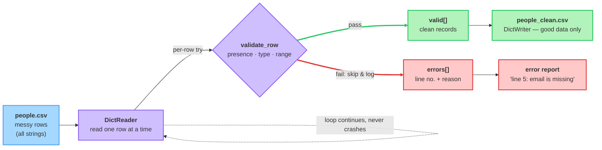

# Case Study: Building a Robust File Reader

<sub>[&#8592; Previous: 7.2 Errors & Exceptions](../../../../../../content/ai_native_engineering_foundations/p5-files-exception-handling/week-7/1-files-exception-handling/7-2-errors-exceptions/reading.md)&nbsp;&nbsp;&nbsp;&nbsp;&nbsp;&nbsp;|&nbsp;&nbsp;&nbsp;&nbsp;&nbsp;&nbsp;[Go back to TOC](../../../../../../README.md)&nbsp;&nbsp;&nbsp;&nbsp;&nbsp;&nbsp;|&nbsp;&nbsp;&nbsp;&nbsp;&nbsp;&nbsp;[Next: 8.1 Version Control Basics &#8594;](../../../../../../content/ai_native_engineering_foundations/p6-git-github-portfolio/week-8/1-git-diagnostic/8-1-version-control-basics/artifacts/reading.md)</sub>

---

## Overview

You now have every part you need: in 7.1 you learned to open files and read a CSV, and in 7.2 you learned to catch exceptions instead of crashing. This capstone puts them together against a hard fact of professional life — **real data is dirty**. A CSV from a spreadsheet, a form, or another team will have blank cells, a price typed as `"free"`, or a missing column. This topic builds a **robust file reader**: one that processes what it can, sets aside what it can't, records *why* each bad row failed, and keeps going to the end. No new syntax — just `with`, `csv.DictReader`, `try`/`except`, validation, `raise`, and `csv.DictWriter` combined into one program you could drop into a real project [1][2].

## Key Concepts

**Why "robust" means "keep going."** A **robust** reader survives bad input. Its opposite is a **fragile** reader: one bad row stops the whole program with a traceback, discarding every row already read and every row not yet reached. That is almost never what you want, because the failure is usually in the *data*, not your code — and the person who can fix the data needs to know *which* rows were bad and *why* [3]. The core behavior has a name we'll use throughout: the **skip-and-log pattern**. For each row, try to process it; if it fails, record the failure and move on. Nothing crashes the loop, and at the end you know exactly what happened to every row.

Analogy: think of a quality inspector on a conveyor belt. A defective item doesn't stop the belt — the inspector pulls it off, drops it in the "rejects" bin with a note ("cracked lid"), and lets the belt keep moving. Good items flow on to shipping. A fragile reader is an inspector who shuts down the entire factory on seeing the first defect.

The diagram below shows the whole pipeline: `DictReader` feeds one row at a time into `validate_row`, which splits every row into one of two buckets — `valid[]` (good data, headed for the clean output file) or `errors[]` (line number plus reason, headed for the report). The dashed loop-back is the point: the reader never crashes, it just keeps pulling rows.



**Per-row `try`/`except` — putting the guard in the right place.** The whole trick is *where* the `try`/`except` sits. Here you wrap the body of the loop, once per row. Because the `try` is *inside* the `for`, an exception raised while processing one row jumps only to that iteration's `except`, and Python continues with the next row [1]. Wrap the loop from the outside instead, and the first bad row breaks out of everything — that is the fragile version. Same exceptions, same handlers; placement is the entire difference.

**Validation — deciding what "bad" means.** Before you can reject a row you must define a *good* one. **Validation** checks a row against rules on three axes:

- **Presence** — the columns you need exist. A missing key raises `KeyError` (from 7.2), or use `row.get()` and check for `None`.
- **Type / format** — `int(row["age"])` succeeds. Recall from 7.1 that everything read from a CSV is a **string**, so numeric fields must be converted, and `int("thirty")` raises `ValueError` (from 7.2) — conversion is exactly where bad data reveals itself.
- **Range / business rule** — even a valid integer can be nonsense. An `age` of `-5` is the right type but the wrong value, so *you* `raise ValueError("age out of range")` yourself (the raise-early idea from 7.2).

Validation fails in two ways and both are handled identically: Python raises for you, or you raise when a rule is broken. Either way the per-row `except` catches it.

**Separating valid from invalid — and logging.** The output of a robust reader is not one thing, it's **two collections** [3]: a list of **valid records** (rows that passed every check, converted to clean Python values) and a list of **errors** (one entry per bad row, recording *which* line and *why*). Keeping them separate is the payoff — downstream code trusts every item in the valid list, and a human reads the error list to fix the source file. "Logging" here just means *recording* each rejection somewhere you can inspect later; a plain list you `append` to captures it perfectly, no special library required.

**`DictReader` and short rows.** We build on `csv.DictReader` (from 7.1) because addressing fields by name — `row["age"]` — is clearer than by position and survives reordered columns [2]. One wrinkle: if a data row has *fewer* values than headers, the missing columns are filled with `restval` (default `None`) — a short row won't raise on its own, so `age` quietly becomes `None` and your presence check must catch it [2].

## Worked Example

Our sample file `people.csv` is deliberately messy:

```
name,age,email
Sam,34,sam@example.com
Ada,thirty,ada@example.com
Lee,-5,lee@example.com
Kai,29
Rob,41,rob@example.com
```

Sam is fine; Ada's age isn't a number (`ValueError`); Lee's age is out of range (business-rule failure); Kai is missing the `email` column (a short row — `email` becomes `None`); Rob is fine. We build in four moves.

**Move 1 — the fragile version (what NOT to ship).**

```python
import csv

def read_people_fragile(path):
    people = []
    with open(path, newline="") as f:
        reader = csv.DictReader(f)
        for row in reader:
            person = {
                "name": row["name"],
                "age": int(row["age"]),          # explodes on "thirty"
                "email": row["email"].lower(),
            }
            people.append(person)
    return people

print(read_people_fragile("people.csv"))
```

This crashes on Ada's row with `ValueError: invalid literal for int() with base 10: 'thirty'`. Sam's good row is thrown away when the exception propagates, and Lee, Kai, and Rob are never even read. One bad cell, total loss.

**Move 2 — add the per-row guard (skip-and-log).** Move the `try`/`except` *inside* the loop so one bad row can't sink the rest:

```python
import csv

def read_people(path):
    valid = []
    errors = []
    with open(path, newline="") as f:
        reader = csv.DictReader(f)
        for line_no, row in enumerate(reader, start=2):   # data starts on line 2
            try:
                person = {
                    "name": row["name"],
                    "age": int(row["age"]),
                    "email": row["email"].lower(),
                }
                valid.append(person)
            except (ValueError, KeyError, AttributeError) as err:
                errors.append({"line": line_no, "row": row, "reason": str(err)})
    return valid, errors
```

`enumerate(reader, start=2)` numbers rows from 2, since line 1 was the header — so error messages point at the real line. The grouped `except (ValueError, KeyError, AttributeError)` catches the three ways this row can fail: `int()` on a non-number (`ValueError`), a missing key (`KeyError`), and `.lower()` on `None` when a short row left `email` as `None` (`AttributeError`).

**Move 3 — add real validation with a raised error.** `int("-5")` succeeds, so Lee's out-of-range age slips through Move 2. Add an explicit business-rule check and `raise` your own `ValueError`. Pulling validation into its own function keeps the loop readable (3.1):

```python
import csv

def validate_row(row):
    """Return a clean person dict, or raise ValueError/KeyError if the row is bad."""
    name = row["name"]                      # KeyError if column missing
    age_text = row.get("age")               # None if missing (short row)
    email = row.get("email")

    if not name:
        raise ValueError("name is empty")
    if age_text is None:
        raise ValueError("age is missing")
    age = int(age_text)                     # ValueError if not a number
    if age < 0 or age > 150:
        raise ValueError(f"age {age} out of range")
    if not email:
        raise ValueError("email is missing")

    return {"name": name, "age": age, "email": email.lower()}


def read_people(path):
    valid = []
    errors = []
    with open(path, newline="") as f:
        reader = csv.DictReader(f)
        for line_no, row in enumerate(reader, start=2):
            try:
                valid.append(validate_row(row))
            except (ValueError, KeyError) as err:
                errors.append({"line": line_no, "row": row, "reason": str(err)})
    return valid, errors
```

Now every rule funnels through one `raise`/`except` channel: whether Python raises (`int("thirty")`) or we raise (`age -5 out of range`, `email is missing`), the loop's `except` catches it, logs it, and moves on.

**Move 4 — run it, report, and write valid rows out.** The caller uses the two collections: print a summary of the errors, and write the clean rows to a new CSV with `csv.DictWriter` (the writer side of the `csv` module from 7.1) so downstream code only sees good data [1][2]:

```python
valid, errors = read_people("people.csv")

print(f"Read {len(valid)} valid rows, {len(errors)} bad rows.\n")

print("Valid records:")
for person in valid:
    print(" ", person)

print("\nErrors:")
for e in errors:
    print(f"  line {e['line']}: {e['reason']}  ->  {e['row']}")

# Separate the valid data into its own file
with open("people_clean.csv", "w", newline="") as f:
    writer = csv.DictWriter(f, fieldnames=["name", "age", "email"])
    writer.writeheader()
    writer.writerows(valid)
```

Expected output:

```
Read 2 valid rows, 3 bad rows.

Valid records:
  {'name': 'Sam', 'age': 34, 'email': 'sam@example.com'}
  {'name': 'Rob', 'age': 41, 'email': 'rob@example.com'}

Errors:
  line 3: invalid literal for int() with base 10: 'thirty'  ->  {'name': 'Ada', 'age': 'thirty', 'email': 'ada@example.com'}
  line 4: age -5 out of range  ->  {'name': 'Lee', 'age': '-5', 'email': 'lee@example.com'}
  line 5: email is missing  ->  {'name': 'Kai', 'age': '29', 'email': None}
```

And `people_clean.csv` now contains only the two good rows:

```
name,age,email
Sam,34,sam@example.com
Rob,41,rob@example.com
```

That is the complete robust reader: it read the entire messy file, kept the 2 good rows, rejected the 3 bad ones *with reasons and line numbers*, never crashed, and produced a clean output file the rest of the system can trust.

## In Practice

- **Data import / ETL.** Loading a customer's CSV into a database: import the valid rows and hand back a rejects report so they can fix and resend. The valid/invalid split *is* the deliverable [3].
- **Form and upload processing.** A web app that accepts an uploaded spreadsheet accepts the good rows and shows the user "row 12: invalid email" — the exact skip-and-log shape built above.
- **Parsing exercises and interviews.** "Parse this CSV, skipping malformed lines" is a common coding task; per-row-try plus collect-errors is the expected answer [3].
- **Nightly batch jobs.** A scheduled job that must finish even when a few records are dirty relies on skip-and-log; the error list becomes tomorrow's cleanup ticket.
- **Do:** wrap each row (not the whole loop), record the line number with `enumerate(..., start=2)`, validate presence/type/range, return two collections, and catch specific exceptions like `except (ValueError, KeyError)` [1][3].
- **Don't:** use a bare `except:` that hides real bugs, or skip a row without logging it — silent data loss is worse than a crash.

## Key Takeaways

- A **robust reader** processes an entire file even when some rows are bad, using the **skip-and-log pattern**: reject the bad row with a reason, then continue.
- The key move is placing the `try`/`except` **inside** the read loop, so a failure jumps to that one iteration's handler and the loop keeps going.
- **Validation** checks presence, type, and range; failures come either from Python (`ValueError`, `KeyError`) or from a rule *you* enforce with `raise`, and the per-row `except` handles both the same.
- A robust reader returns **two collections** — valid records and an errors report with line numbers and reasons — so clean data and rejects never mix.
- The full pattern combines the whole module: `with` + `csv.DictReader` to read, per-row `try`/`except` to guard, validation + `raise` to judge, and `csv.DictWriter` to write clean rows out.

## References

1. Real Python — *Reading and Writing CSV Files in Python*. https://realpython.com/python-csv/
2. Python documentation — *csv — CSV File Reading and Writing*. https://docs.python.org/3/library/csv.html
3. Real Python — *Parsing CSV data*. https://realpython.com/python-csv/#parsing-csv-files-with-pythons-built-in-csv-library

---

<sub>[&#8592; Previous: 7.2 Errors & Exceptions](../../../../../../content/ai_native_engineering_foundations/p5-files-exception-handling/week-7/1-files-exception-handling/7-2-errors-exceptions/reading.md)&nbsp;&nbsp;&nbsp;&nbsp;&nbsp;&nbsp;|&nbsp;&nbsp;&nbsp;&nbsp;&nbsp;&nbsp;[Go back to TOC](../../../../../../README.md)&nbsp;&nbsp;&nbsp;&nbsp;&nbsp;&nbsp;|&nbsp;&nbsp;&nbsp;&nbsp;&nbsp;&nbsp;[Next: 8.1 Version Control Basics &#8594;](../../../../../../content/ai_native_engineering_foundations/p6-git-github-portfolio/week-8/1-git-diagnostic/8-1-version-control-basics/artifacts/reading.md)</sub>
