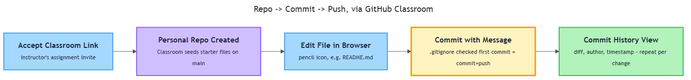

# Version Control Basics

[&#8592; Previous: 7.3 Case Study: Building a Robust File Reader](../../../../../../../content/ai_native_engineering_foundations/p5-files-exception-handling/week-7/1-files-exception-handling/7-3-case-study-building-a-robust-file-reader/reading.md)&nbsp;&nbsp;&nbsp;&nbsp;&nbsp;&nbsp;|&nbsp;&nbsp;&nbsp;&nbsp;&nbsp;&nbsp;[Go back to TOC](../../../../../../../README.md)&nbsp;&nbsp;&nbsp;&nbsp;&nbsp;&nbsp;|&nbsp;&nbsp;&nbsp;&nbsp;&nbsp;&nbsp;[Next: 8.2 Portfolio Diagnostic &#8594;](../../../../../../../content/ai_native_engineering_foundations/p6-git-github-portfolio/week-8/1-git-diagnostic/8-2-portfolio-diagnostic/artifacts/reading.md)

---

## Overview

Version control means treating every saved snapshot of a project as a permanent, labeled point you can return to — instead of relying on file names like `analysis_v2_FINAL.py` or a shared folder, which both fall apart the moment more than one person, or one point in time, is involved[1][2]. Git is the version control tool nearly every professional team uses, and GitHub is where teams host it so people can collaborate. Starting with this topic, every diagnostic, lab, and portfolio piece you produce for the rest of the program lives inside a Git repository — the repo *is* the submission, continuously, not a file you email once. _This contributes to A3 — Python Foundations Diagnostic (due W8) — where a professional Git portfolio is graded alongside your Python code._

## Key Concepts

**Git is a version control system**: it records a project's history as a sequence of snapshots, so you can see what changed, when, and by whom, and recover any earlier state[1]. It tracks *changes*, not just files — it knows a specific line of `main.py` was edited, not merely that the file got replaced by a newer copy[1][2].

Professionals rely on it because mistakes and multi-person collaboration are both guaranteed, and version control delivers three things at once[2]:
- **Backup** — nothing committed is ever truly lost.
- **History** — you can see exactly what changed and why.
- **Collaboration** — multiple people can work on the same project without overwriting each other.

Concrete case: two learners editing the same shared file over a week. Without version control, whoever saves last silently overwrites the other — no record the first edit ever existed. With Git, both edits land as separate, timestamped commits; nothing is destroyed, and the full who-changed-what-when sequence stays inspectable afterward[1][2].

Git is also *distributed*: every copy of a repository carries the entire project history, not a pointer to one central server[1][2]. You can work offline, inspect history, and make progress with no network connection, and no single machine is a single point of failure[2].

**Three vocabulary words carry most of the beginner workload**[1][2]:
- **Repository ("repo")** — a project folder Git tracks, containing your files plus a hidden history of every snapshot. It can live only on your machine, or also exist on GitHub as a *remote* — a hosted copy others can reach[2].
- **Commit** — a saved snapshot paired with a short message describing what changed. Treat one logical unit of work as one commit — not every keystroke, and not an entire day bundled together[2][3].
- **Push** — sending local commits to the remote so they become visible to anyone with access. Until you push, commits are safe on your machine but invisible to a collaborator or grader[1][2].

Separating commit from push matters: you can make several small checkpoints locally — trying something, backing it out, trying again — without any of that in-progress churn being visible, then push once you're ready[2][3]. A message like `"stuff"` forces a reader to reconstruct intent from the view showing exactly which lines changed every time; `"Add data-cleaning function for missing timestamps"` tells them immediately, and that changed-lines view then confirms rather than replaces it[2][3].

**GitHub Classroom** is how your instructor distributes this loop to a whole cohort at once: accepting an assignment link automatically creates a personal repository under your account, seeded with any starter files, with access granted to you and your instructor[4][5]. Click the link again later and Classroom returns you to your existing repo rather than making a second one[4][5]. Everything you push there is what your instructor sees — Classroom's whole point is that progress is automatically visible without a separate submission step[4][5]. Because that repo is genuinely yours in the access-and-push sense, treat your very first commit in it as real practice, not throwaway — it's the same repo your later diagnostics and portfolio pieces build on[4].

You don't need a terminal to start this loop. GitHub's web interface lets you edit a file and click "Commit changes," and that single action both commits and pushes — the same snapshot mechanism described above, performed through a form instead of a command line[2][4]. The commits view on any repo lists every snapshot in order, with message, author, and timestamp; opening one shows exactly which lines changed[1][2]. This browser-first path is deliberate: it isolates the *concept* of a commit from the *mechanics* of a terminal, and a browser-made commit is not a "lesser" commit — it lands in the same history a terminal-made one would[1][2][4].

*Accepting a Classroom link provisions your personal repo, and editing a file in the browser with a commit message is what populates that repo's commit history.*

Four habits separate a repo that reads as professional from one that doesn't — worth building from your first commit, not retrofitted later[3][4]:
- **README as the front door.** GitHub renders `README.md` automatically on a repo's main page — often the only thing a visitor or grader sees. A missing or one-line README is a genuine defect, not a cosmetic gap: it gives every other file context before anyone reads a line of code[3][4]. A weak README ("This is my project") and a strong one ("A command-line tool that summarizes CSV survey data into a single readable report; run it with one argument, the input file path") take about the same typing — the difference is entirely whether the author thought about the reader[3].
- **Small, descriptive commits.** Keep each commit to one logical change, and write what changed and why, not just that something changed. This is also what makes history useful for debugging: if something breaks, you can pinpoint exactly which commit introduced it[2][3].
- **`main` vs. a feature branch (light intro).** `main` is the default branch, treated as the stable, working version. A **feature branch** is a copy made to try something without touching `main` until it's ready. At this stage, just hold the concept: `main` is "the real thing," a feature branch is "a sandboxed attempt"[2][3].
- **`.gitignore` for secrets.** A `.gitignore` tells Git which files to never track — API keys, passwords, credentials. This isn't cosmetic: a committed secret stays in the repo's permanent history even after you delete the file in a later commit, because Git preserves old snapshots rather than overwriting them[1][2][3].

## Worked Example

Here is the full loop, done entirely in the browser, for a GitHub Classroom repo[2][4][5]:

1. Open the Classroom assignment link your instructor provides and accept it — GitHub creates your personal copy of the repo and adds you as a collaborator[4][5].
2. Confirm the repo exists under your account; note any starter files and the repo's name, which typically combines the assignment and your identity[4].
3. Open `README.md` (or create one) and click the pencil icon to edit it in the browser[4].
4. Add a two- or three-sentence project description — a small, meaningful change[3][4].
5. Scroll to the commit box, write a specific message (not "update"), and click "Commit changes" — this commits and pushes in one step[2][4].
6. Open the commits view to confirm your commit appears with your message and timestamp[1][2].
7. Open that commit and check that the changed-lines view shows only the lines you changed — confirming it was small and scoped[3].
8. Repeat steps 3–6 for a second, unrelated change — for example, adding a `.gitignore` with a placeholder entry — so the history shows two distinct, separately-messaged commits[1][3].
9. Compare both commits in the history view: each should read, on its own, as a complete explanation of one change[2][3].

A common mistake is bundling the README edit, `.gitignore`, and unrelated changes into one end-of-session commit. It will still push, but a single message now has to describe several unrelated things, and none can be inspected independently later[2][3]. The opposite mistake — waiting to commit until an assignment feels "finished" — is also unnecessary: a commit is a checkpoint, not a finish line, and Classroom-based grading looks at the whole history, not just the last snapshot[4][5].

## In Practice

Where this shows up on real teams[2][3][4]:
- A production `main` branch is typically protected — changes arrive as small commits on a feature branch, get reviewed, and only then join `main`, because `main` is usually what's actually running for users[2][3].
- Commit history is treated as documentation, not just backup: engineers read old commit messages to answer "why is this line here?" months later — which only works if someone wrote a specific message at the time. Open-source projects make this especially visible: a project's public history is often the only record of why a design decision was made[1][2][3].
- A README is often a hiring manager's first, and sometimes only, exposure to a candidate's work when browsing a GitHub profile[3][4].
- Leaked credentials in committed files are one of the most common, and most preventable, real security incidents — bots scrape public repos for them within minutes of a push, and because history is preserved, a leaked secret must be treated as compromised and replaced, not just deleted[1][2][3].
- Experienced engineers still use the browser editor for small, low-risk changes — a documentation typo, one config value — because opening a full local environment is more overhead than the change itself[4][5].

Do / don't, condensed[1][2][3][4][5]:
- Do commit early and often; a commit is cheap, losing work is not.
- Do write commit messages as a sentence describing the change, not a single vague word.
- Do keep secrets out of tracked files from the first commit — add `.gitignore` entries before you need them.
- Do check, before you push, that the change actually matches what your commit message says.
- Don't treat `main` as a scratchpad for half-finished experiments once branching is in play.
- Don't bundle unrelated changes into one commit just to save time.
- Don't wait until a project feels "done" to make your first commit — there is no such thing as too early.
- Don't assume deleting a leaked secret in a later commit removes it from history — treat any committed secret as compromised and replace it.
- Don't guess if you ever end up with more than one repo for the same assignment — re-open the original Classroom link rather than assuming which copy is the real one.

## Key Takeaways

- Version control exists because software mistakes and multi-person collaboration are guaranteed; Git gives you backup, history, and collaboration in one tool[1][2].
- The core loop is repository → commit → push: a repo holds tracked history, a commit is a described snapshot, and a push sends commits to a remote like GitHub[1][2].
- GitHub Classroom turns an assignment link into your own ready-to-use repo, with no manual setup[4][5].
- You can do real, committed work entirely from GitHub's web interface — edit, commit, and read history — before ever touching a terminal[1][2][4].
- A strong repo has a real README, small descriptive commits, an early `.gitignore` for secrets, and treats `main` as the stable line, keeping experiments off it[2][3].

## References

[1] Official Git documentation (git-scm.com reference manual).
[2] *Pro Git*, "Getting a Git Repository," https://git-scm.com/book/en/v2/Git-Basics-Getting-a-Git-Repository
[3] widdowquinn, github-best-practice README, https://github.com/widdowquinn/github-best-practice/blob/master/README.md
[4] UNO IST Support, GitHub Classroom for UNO Students, https://github.com/UNO-IST-Support/GitHubClassroom_for_UNOStudents
[5] Bill Mongan, "GitHub Classroom" walkthrough, https://www.billmongan.com/posts/2020/02/githubclassroom/

---

[&#8592; Previous: 7.3 Case Study: Building a Robust File Reader](../../../../../../../content/ai_native_engineering_foundations/p5-files-exception-handling/week-7/1-files-exception-handling/7-3-case-study-building-a-robust-file-reader/reading.md)&nbsp;&nbsp;&nbsp;&nbsp;&nbsp;&nbsp;|&nbsp;&nbsp;&nbsp;&nbsp;&nbsp;&nbsp;[Go back to TOC](../../../../../../../README.md)&nbsp;&nbsp;&nbsp;&nbsp;&nbsp;&nbsp;|&nbsp;&nbsp;&nbsp;&nbsp;&nbsp;&nbsp;[Next: 8.2 Portfolio Diagnostic &#8594;](../../../../../../../content/ai_native_engineering_foundations/p6-git-github-portfolio/week-8/1-git-diagnostic/8-2-portfolio-diagnostic/artifacts/reading.md)
